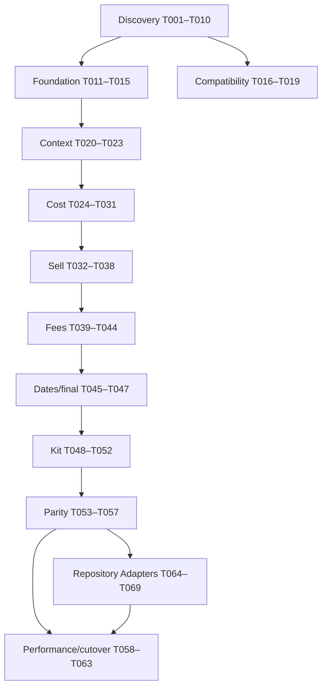

# Tasks: COBOL Pricing Modernization

## Conventions

- `[CLAUDE]`: Claude Code owns the work product.
- `[CODEX]`: Codex owns the implementation.
- `[SHARED]`: named owner executes; other agent reviews.
- `[P]`: may run in parallel with other tasks whose dependencies are satisfied.
- `[ ]` not started, `[~]` claimed/in progress, `[x]` complete, `[!]` blocked.
- Every task must satisfy `AGENTS.md` handoff requirements.

## Dependency Overview

## Phase 1 — Discovery and Evidence

- [ ] T001 [CLAUDE] Create `docs/cobol-analysis/program-inventory.md` for every supplied CBL/CPY file, including purpose, interface, calls, copies, SQL includes, major paragraphs, errors, and missing dependencies.
  - Depends on: none
  - Acceptance: all supplied files and visible links/includes accounted for; regular and kit call graph included; confidence labels used.

- [ ] T002 [P] [CLAUDE] Create `docs/cobol-analysis/call-graph.md` with CICS links, request/response structures, routing conditions, and unresolved targets.
  - Depends on: none
  - Acceptance: caller/callee, COMMAREA, CICS response handling, and product-type routing documented.

- [x] T003 [P] [CLAUDE] Create `docs/mappings/omgpr-data-dictionary.csv` and `.md` with every field, PIC, storage, sign, scale, occurrence, classification, default, 88 values, proposed C# type, length, and offset/confidence.
  - Owner: Claude
  - Reviewed by: Codex for T013 implementability; COMP sizing and live-layout open items remain compatibility blockers.
  - Depends on: none
  - Acceptance: reconciles or explicitly explains the 1,789-byte layout; no unmarked guesses.

- [ ] T004 [P] [CLAUDE] Create `docs/mappings/omgexpl-data-dictionary.csv` and `docs/cobol-analysis/kit-processing.md`.
  - Depends on: none
  - Acceptance: component capacity, quantity, UOM, level, sub-pack, rollup, errors, and expiration documented.

- [ ] T005 [P] [CLAUDE] Create `docs/cobol-analysis/sql-query-inventory.csv` and `db2-table-inventory.md` for all visible SQL blocks and includes.
  - Depends on: none
  - Acceptance: host variables, date filters, ordering, SQLCODE paths, cursor lifecycle, and business purpose captured.

- [ ] T006 [P] [CLAUDE] Create `docs/cobol-analysis/error-catalog.md` mapping validation, SQL, CICS, kit, and component error paths to OMGPR fields.
  - Depends on: T001
  - Acceptance: error numbers/codes/messages and stop/continue behavior documented.

- [ ] T007 [CLAUDE] Create `docs/rules/cost-selection-rules.md` as an ordered decision table starting from A6U01 cost control paragraphs and all transitive paragraphs.
  - Depends on: T001, T005
  - Acceptance: individual, account/customer, group, parent, special, healthcare, and acquisition fallback paths covered where evidenced.

- [ ] T008 [P] [CLAUDE] Create `docs/rules/sell-selection-rules.md` with hierarchy, formulas, price lock, and list-price fallback.
  - Depends on: T001, T005
  - Acceptance: account, customer, contract, group, parent, corporate, product, category, vendor, and default paths covered.

- [ ] T009 [P] [CLAUDE] Create `docs/rules/fees-and-adjustments.md` covering rebates, freight, JIT, PANDAC, SurgiTrak, low-UOM, break-bulk, label/application, delivery, surcharge, distribution, and markup.
  - Depends on: T001, T005
  - Acceptance: eligibility, priority, exemptions, calculation, dates, outputs, and errors per rule.

- [ ] T010 [P] [CLAUDE] Create `docs/rules/date-selection.md`, `rounding.md`, and `docs/characterization/scenario-catalog.md`.
  - Depends on: T001, T005
  - Acceptance: boundary behavior, null dates, closest expiration, rounding stages, and minimum scenario matrix documented.

### Gate G1 — Discovery Review

- [x] G1 [SHARED] Codex reviews T001–T010 for implementability; Claude resolves evidence gaps or marks blockers. No pricing-rule implementation starts before approval.
  - Owner: Codex
  - Reviewer: Codex
  - Review: `docs/reviews/g1-implementability-review.md`
  - Evidence: Codex re-reviewed T001–T010 directly from `origin/agent/claude-discovery` at `ff0c9f0e31e0dd85055c2ef8a62033fa2ffb21e6`; each prior gap is classified in the review as resolved, partially resolved with a downstream blocker, or explicitly blocked due to unavailable source.
  - Approved: Codex reviewed T001–T010 through Claude commit `ff0c9f0`; unresolved evidence is explicitly scoped as downstream blockers.

## Phase 2 — .NET Foundation

- [x] T011 [P] [CODEX] Create the .NET 8 solution and projects from `plan.md` with central package management, nullable references, analyzers, and baseline tests.
  - Owner: Codex
  - Depends on: none
  - Acceptance: clean restore/build/test; dependency direction documented and enforced.

- [x] T012 [P] [CODEX] Configure Pricing.Api with OpenAPI, ProblemDetails, health checks, structured logging, OpenTelemetry, correlation, and cancellation.
  - Owner: Codex
  - Depends on: T011
  - Acceptance: API starts; health/OpenAPI available; smoke tests pass.

- [x] T013 [P] [CODEX] Implement domain value objects: Money, Percentage, identifiers, UOM, Quantity, and PricingDateRange.
  - Owner: Codex
  - Depends on: T011, T003 reviewed
  - Acceptance: immutable; decimal-only; validation, equality, serialization, and boundary tests.

- [x] T014 [P] [CODEX] Implement PricingRequest, PricingContext, PricingResult, ProductInformation, CustomerInformation, ContractSelection, SellArrangementSelection, PriceComponent, and typed errors.
  - Owner: Codex
  - Depends on: T011, T013
  - Acceptance: models separate input/context/output and retain provenance.

- [x] T015 [CODEX] Add CI workflow for formatting, restore, build, tests, analyzers, dependency audit, and test artifacts.
  - Owner: Codex
  - Depends on: T011
  - Acceptance: workflow syntax validated; local equivalents documented.

## Phase 3 — OMGPR Compatibility

- [ ] T016 [CLAUDE] Produce `docs/mappings/omgpr-test-vectors.json` with confirmed positive, negative, zero, scale, spaces, low values, and error-field cases.
  - Depends on: T003, G1
  - Acceptance: every vector cites copybook definition; unknown encoding/byte order parameterized.

- [x] T017 [CODEX] Implement configurable alphanumeric, COMP, and COMP-3 primitives in Pricing.Compatibility.
  - Owner: Codex
  - Depends on: T011, T003, T016
  - Acceptance: valid/invalid, signs, scales, byte order, overflow, and cancellation-independent deterministic tests.
  - Evidence: configurable CP037/Windows-1252 alphanumeric, big/little-endian signed COMP, and signed/unsigned COMP-3 codecs; T016 representative vectors and invalid-format/overflow tests pass.

- [x] T018 [CODEX] Implement 1,789-byte OMGPR decoder and map legacy input to PricingRequest.
  - Owner: Codex
  - Depends on: T014, T017
  - Acceptance: length validation; centralized offsets; vectors pass; no legacy binary concerns leak into domain.
  - Assumption: Claude decision record `d264fde` directs use of the 1,773-byte mainframe-COMP layout within the confirmed 1,789-byte buffer and preservation of bytes 1774–1789 as opaque data.
  - Evidence: configurable mainframe-EBCDIC and Micro Focus ASCII-native decoding, centralized input offsets, exact-length validation, domain mapping, opaque-tail preservation, and 67 focused unit tests pass.

- [x] T019 [CODEX] Implement PricingResult-to-OMGPR encoder and round-trip tests.
  - Owner: Codex
  - Depends on: T018
  - Acceptance: exact output length; preserved required input fields; legacy error fields mapped; test vectors pass.
  - Evidence: conservative overlay encoder writes confirmed cost/sell/expiration/error fields, preserves all original unmapped bytes and the opaque 16-byte tail, and passes 72 focused unit tests plus the full solution suite.

### Gate G2 — Compatibility Review

- [x] G2 [SHARED] Claude reviews codecs against copybooks and vectors; Codex resolves findings. Encoding and byte order must be confirmed or remain deployment blockers.
  - Owner: Codex
  - Reviewer: Claude
  - Handoff: `docs/reviews/g2-compatibility-handoff.md`
  - Review: Claude commit `472e5c1` — NOT APPROVED with six findings.
  - Re-review: Claude commit `f71c7e0` — original six findings verified fixed; one residual severity-field finding.
  - Resolution: Codex addressed all seven findings on 2026-07-21.
  - Approval: Claude commit `f845649`; independently verified 85/85 tests pass.
  - Deployment blockers: live OMGPR encoding and byte order remain unconfirmed pending a compiled listing or COMMAREA capture.

## Phase 4 — Product and Customer Context

- [x] T020 [CODEX] Implement ProductClassificationService based on A6O010U behavior.
  - Owner: Codex
  - Depends on: T014, G1
  - Acceptance: missing vendor/product, regular, kit type O, not found, database failure, and cancellation tests.
  - Evidence: A6O010U `1000-VALIDATE-INPUT`/`0200-READ-PRODUCT-DATA` and A6O016U `2200-READ-PRODUCT-DATA`/`9015-SELECT-VNG02`; 89 focused unit tests and 95 solution tests pass.

- [x] T021 [CODEX] Implement ProductInformationService contract and repository for category, inventory class, base/alternate UOM, conversion, and dates.
  - Owner: Codex
  - Depends on: T014, T005
  - Acceptance: inferred A6O013U behavior isolated and feature-blocked until confirmed.
  - Evidence: A6O013U is now supplied and confirms `1000-VALIDATE-INPUT`/`2000-READ-PRODUCT-DATA`; A6O016U confirms VNG02/VNG06/ING01/VNG05 sequencing and error semantics. 99 focused unit tests and 105 solution tests pass.

- [x] T022 [CODEX] Implement CustomerPricingContextService contracts and orchestration based on CUP100 analysis.
  - Owner: Codex
  - Depends on: T014, T005, G1
  - Acceptance: account/customer, memberships, parents, priorities, exclusions, fees, low-UOM, freight, and components represented.
  - Evidence: CUP100 A200/A300, A425, A800-A850, 1000, 2000, and 3000 context flows are represented behind one business-oriented repository; 105 unit tests and 111 solution tests pass.

- [x] T023 [P] [CODEX] Implement DB2 access infrastructure, connection health, transient-error mapping, query tracing, and integration-test fixtures.
  - Owner: Codex
  - Depends on: T011, T005
  - Acceptance: business-oriented repository boundaries; parameterized SQL; no production credentials; SQL and cancellation tests.
  - Evidence: provider-neutral DB2 connections, Dapper query execution, readiness probe, SQLSTATE/error-code transient mapping, safe OpenTelemetry activities, and sanitized recording fixtures; 8 integration tests and 115 solution tests pass.

## Phase 5 — Cost Engine

- [x] T024 [CODEX] Implement ordered ICostRule framework, evaluator, trace, skip reasons, provenance, and duplicate-priority validation.
  - Owner: Codex
  - Depends on: T014, T007, T022
  - Acceptance: deterministic ordering; first applicable rule semantics; full trace tests.
  - Evidence: immutable applied/skipped/failed decisions, ascending-priority evaluator, explicit skip/not-evaluated trace with provenance, fail-fast configuration validation, and cancellation; 112 unit tests and 122 solution tests pass.

- [x] T025 [P] [CODEX] Implement individual and account/customer cost-contract rules.
  - Owner: Codex
  - Depends on: T024, T023
  - Acceptance: applies/non-applies/excluded/expired/zero/competitor/fallback tests per rule.
  - Evidence: A6U01 0235/0270/0272 individual-customer selection with account/ship-to exclusion outcome, inclusive date defense, cursor-order-preserving strict-lowest duplicate selection, valid first-zero behavior, typed failures, and provenance; 123 unit tests and 133 solution tests pass.

- [x] T026 [P] [CODEX] Implement primary, other, and parent buying-group cost rules.
  - Owner: Codex
  - Depends on: T024, T023
  - Acceptance: membership and priority hierarchy parity tests.
  - Evidence: A6U01 0240/0275/0280 scope ordering, override-before-priority cascade, and 0315/7315/7320/7321 child-then-full-ancestor traversal are represented without flattening; selected contracts retain group, priority, hierarchy, override, and provenance metadata; 132 unit tests and 142 solution tests pass.

- [x] T027 [P] [CODEX] Implement special-contract cost behavior.
  - Owner: Codex
  - Depends on: T024, T007
  - Acceptance: special path, early exit, rounding, and expiration verified.
  - Evidence: OMGPR byte 152 special flag decoding, bypass-B repository contract, priority-50 restricted individual selection, fatal #601 miss, raw cost/suggested-sell output, adjustment and final-rounding bypass, expiration-source retention, and evaluator early exit; 143 unit tests and 153 solution tests pass.

- [x] T028 [P] [CODEX] Implement healthcare override cost rule using HCOVD structures.
  - Owner: Codex
  - Depends on: T024, T023
  - Acceptance: account/CID/group/product/date/type/percent/fixed cases.
  - Evidence: A6U01 9940/9945/9950 account-before-CID eligibility across four inclusive windows, product-over-group flag precedence, 9970 highest-acquisition/earliest-active VNG03 selection, normalized dealer cost, typed COST+ percentage and stated-price terms, provenance, failures, and cancellation; 155 unit tests and 165 solution tests pass.

- [x] T029 [CODEX] Implement acquisition/dealer-cost fallback as last cost rule.
  - Owner: Codex
  - Depends on: T025–T028
  - Acceptance: only runs after all higher rules fail; exemption resets match COBOL.
  - Evidence: A6U01 7105 direct VNG03 selection, 7575 latest-effective/highest-level fallback, and 7190 terminal dealer-cost/UOM copy with JIT/freight exemption resets; 162 unit tests and 172 solution tests pass.

- [x] T030 [CODEX] Implement rebate calculators and contract-entry-method exceptions.
  - Owner: Codex
  - Depends on: T024, T009
  - Acceptance: normal, methods 06/08, zero, negative, max, protected acquisition, and expiration tests.
  - Evidence: A6U01 0030 method-06/08 bypass and 7070 R-REBATE-000–006 base, sequential option overwrite, negative policy, protected acquisition, total, and max-cap behavior; 177 unit tests and 187 solution tests pass.

- [x] T031 [CODEX] Implement vendor cost adjustments and cost-side adjustment composition.
  - Owner: Codex
  - Depends on: T024, T009, T030
  - Acceptance: ordered composition, failure propagation, provenance, and parity fixtures.
  - Evidence: A6U01 0030, 0225/0230, 7215, and 7200 ordered first-match lookup contract, price-lock/healthcare bypass, base-cost percentage calculation, typed failure propagation, rebate-preserving cost composition, provenance, and representative formula fixtures; 189 unit tests and 199 solution tests pass. Live COBOL parity remains Gate G3 scope.

### Gate G3 — Cost Parity

- [!] G3 [SHARED] Run approved cost scenarios and require exact critical-field parity before sell implementation is declared complete.
  - Owner: Codex
  - Reviewer: Claude
  - Decision: NOT APPROVED on 2026-07-21; see `docs/reviews/g3-cost-parity-review.md`.
  - Blockers: no authoritative sanitized COBOL cost fixtures, no executable COBOL/C# cost comparisons, no COBOL adapter/capture, and runtime rounding-tie behavior remains unconfirmed. Current parity and characterization projects contain smoke tests only.

## Phase 6 — Sell Engine

- [x] T032 [CODEX] Implement ordered ISellArrangementRule framework and calculation-strategy contracts.
  - Owner: Codex
  - Depends on: T014, T008, T029
  - Acceptance: deterministic priority, trace, provenance, and no-arrangement behavior.
  - Evidence: A6U01 7180 dispatch into 0180/7075/0185 first-match cascades; deterministic evaluator, complete applied/skipped/not-evaluated/failure trace, explicit no-arrangement result for the later list-price fallback, and 7090 calculation-strategy contracts; 196 unit tests and 206 solution tests pass.

- [x] T033 [P] [CODEX] Implement account and customer-number sell rules.
  - Owner: Codex
  - Depends on: T032
  - Evidence: A6U01 0180/7075/0185 account-before-customer product, contract-override, category, SSC, vendor, and default slots with cost-source cascade eligibility, reserved interleaving for T034/T035 levels, typed repository failures, provenance, and cancellation; 207 unit tests and 217 solution tests pass.

- [x] T034 [P] [CODEX] Implement individual-contract and buying-group/parent sell rules.
  - Owner: Codex
  - Depends on: T032
  - Evidence: A6U01 0180/0181, 7075/7076, and 0185/0186 subgroup membership gates, cascade-specific contract overrides, product/category/SSC/vendor/default order, nearest-parent-first traversal, group-contract parent product-before-contract physical order, provenance, typed failures, and cancellation; 218 unit tests and 228 solution tests pass. Live parity remains blocked under G3.

- [x] T035 [P] [CODEX] Implement corporate, product, category, vendor, and default sell rules.
  - Owner: Codex
  - Depends on: T032
  - Evidence: A6U01 0180 corporate product/category/vendor slots and 7240/7250/7255 same-level group-over-corporate reconciliation, corporate absence from group/acquisition cascades, and a validated composed T033–T035 hierarchy containing account/customer/group/parent product, category, vendor, contract, SSC, and default paths; 229 unit tests and 239 solution tests pass. List-price calculation remains T036 and live parity remains blocked under G3.

- [x] T036 [CODEX] Implement fixed, stated, cost-plus, cost-discount, gross-margin, suggested-sell, and list-price calculators.
  - Owner: Codex
  - Depends on: T032, T010
  - Acceptance: formula, scale, zero, negative guard where applicable, and rounding tests.
  - Evidence: A6U01 7090 method codes 1–8, business-type list selection, gross-margin clamp, cost-plus/list-less formulas, suggested-sell eligibility fallbacks, stated-price UOM conversion, HC fixed/COST+ last-word dispatch, typed source/conversion failures, cancellation, provenance, and eight-decimal compute-stage rounding; 247 unit tests and 257 solution tests pass. Live COBOL parity remains blocked under G3.

- [x] T037 [CODEX] Implement price-lock behavior and tests.
  - Owner: Codex
  - Depends on: T033–T036
  - Evidence: A6U01 7765/0210/7205 CUG31 lookup, base-to-ordered-UOM conversion, percentage-method versus price-method reconciliation, frozen sell less locked sell adjustment, expiration provenance, and the 7210/7215 surcharge/vendor-adjustment bypass flags; typed conversion failure and cancellation included. 264 unit tests and 274 solution tests pass; live COBOL parity remains blocked under G3.

- [x] T038 [CODEX] Implement sell adjustments and compose base sell, adjustments, and provenance.
  - Owner: Codex
  - Depends on: T037, T009
  - Evidence: A6U01 7195 composition of inventory-class, risk, delivery, finance, non-contract, prepay, JIT sell/cost, PANDAC, and SurgiTrak buckets; R/A JIT exclusion, monthly separate-billing gates, signed deduction handling, base/error preservation, itemized provenance, and eight-decimal staged totals. 275 unit tests and 285 solution tests pass; T039–T044 calculators remain separate and live COBOL parity remains blocked under G3.

## Phase 7 — Fees and Surcharges

- [x] T039 [P] [CODEX] Implement freight engine with account-first priority and single-source winner semantics.
  - Owner: Codex
  - Depends on: T009, T023, T031
  - Evidence: A6U01 7200/0205/7226 applicability gates; account then CID precedence; single-winner buying-group/product/division/corporate waterfall; C/S/V basis calculations, account/CID V-to-S downgrade, product UOM scaling, monthly sell exclusion, exemption zeroing with audit type recoding, effective-date provenance, cancellation, and typed dependency failures. 288 unit tests and 298 solution tests pass; live COBOL parity remains blocked under G3.

- [x] T040 [P] [CODEX] Implement JIT engine for A/C/P/R behaviors and exemptions.
  - Owner: Codex
  - Depends on: T009, T031, T038
  - Evidence: A6U01 7195/7225 customer, contract-line, and A/C/P/R gates; private-label-O sell override; percentage/rate/per-item label and apply-label formulas; 2022 apply-label fast path; service/LUOM/extra-delivery/non-OM components; cost/sell routing and asymmetric A/R removal; staged rounding, provenance, and explicit T041 low-UOM redirect handoff. 306 unit tests and 316 solution tests pass; live COBOL parity remains blocked under G3.

- [x] T041 [P] [CODEX] Implement low-UOM and break-bulk engines including eligibility, vendor/contract exclusions, group hierarchy, alt UOM, and zero percentage.
  - Owner: Codex
  - Depends on: T009, T023
  - Evidence: A6U01 0245/7872–7898 eligibility and stock gates, confirmed contract and group-only BGG25 vendor exclusion, account-first then priority/parent group selection, quantity-dependent VNG05/direct/base UOM designator resolution, exact-divisibility matching, legacy JIT-basis formula, 2022 PANDAC suppression/flat/percentage paths, private-label override, zero percentage, staged rounding, provenance, cancellation, and typed lookup errors. 318 unit tests and 328 solution tests pass; unconsumed BGG24 behavior was not invented and live COBOL parity remains blocked under G3.

- [x] T042 [P] [CODEX] Implement PANDAC and SurgiTrak behavior including implied sell arrangement where evidenced.
  - Owner: Codex
  - Depends on: T009, T038
  - Evidence: A6U01 0165/0170/7705/7706/7707 live PANDAC eligibility and new-specific/legacy-specific/default priority, CUTADR applicability fallback, new whole-percent scaling, legacy cost rate, flat/resolved-default boundaries, monthly billing and audit fields, typed failures, and explicit non-implied live fall-through; 7758 SurgiTrak Owens-product/fee-row gates, flat/cost/sell formulas, unknown no-op, rounding, monthly fold-in, and provenance. 332 unit tests and 342 solution tests pass; live COBOL parity remains blocked under G3.

- [x] T043 [P] [CODEX] Implement label, application, extra-delivery, and distribution fees.
  - Owner: Codex
  - Depends on: T009, T023
  - Evidence: A6U01 7225 label/application/extra-delivery outputs are exposed as distinct explainable fee components while preserving the confirmed absence of an independent label/application billing-frequency branch; 7095 distribution GS/GN/MI/MN/MC bucket amounts decompose embedded margin and monthly MA/MM billing subtracts it from line sell. Zero/negative margins and provenance are covered. 347 unit tests and 357 solution tests pass; T044 retains category selection and broader markup/surcharge composition, and live COBOL parity remains blocked under G3.

- [x] T044 [CODEX] Implement category surcharge and sanctioned/non-sanctioned/individual/non-contract/customer markup composition.
  - Owner: Codex
  - Depends on: T009, T038
  - Evidence: A6U01 0215/0250/7210 exact account/CID/division/corporate category/general-vendor/default priority plus buying-group fallback, price-lock bypass, soft lookup failure, truncated surcharge arithmetic, and monthly MA/MM handling; 7090/7095 custom/sanctioned/non-sanctioned/individual/non-contract and stock/usage classification, legacy error 602, .9999 margin clamp, gross-margin calculation, and T043 distribution-fee composition. 359 unit tests and 369 solution tests pass; live COBOL parity remains blocked under G3.

## Phase 8 — Dates, Rounding, and Final Result

- [x] T045 [CODEX] Implement ExpirationDateCollector with source provenance and closest-valid-date logic.
  - Owner: Codex
  - Depends on: T010
  - Acceptance: null, duplicate, expired, same-day, leap-day, competing, and component tests.
  - Evidence: A6U01 7695 accumulator and 7720 resolver implemented with a 50-valid-candidate limit, typed legacy error 145, inclusive same-day validity, earliest-date selection, duplicate winner provenance, null/open-ended and expired-source exclusion, and immutable component source results. All 10 focused tests and 369 unit/379 solution tests pass; live COBOL parity remains blocked under G3.

- [x] T046 [CODEX] Implement COBOL-compatible rounding policy and account configuration.
  - Owner: Codex
  - Depends on: T010, T013
  - Acceptance: proves stage-sensitive cases and all supported modes.
  - Evidence: OMGPR.CPY account codes blank/N, R, and Y plus A6U01 7715 final-stage behavior implemented with independent unit/total rounding, unconditional unrounded-value retention, exact 0.0049 bias, silent unknown-code no-op, intermediate half-away-from-zero policy, and the surcharge truncation exception. All 18 focused tests and 387 unit/397 solution tests pass; the compiler-default tie assumption and live COBOL parity remain blocked under G3.

- [x] T047 [CODEX] Implement PricingOrchestrator and PricingResultFactory across context, cost, rebate, sell, fees, rounding, expiration, warnings, and errors.
  - Owner: Codex
  - Depends on: T031, T038–T046
  - Acceptance: full regular-item scenario tests and explainable output.
  - Evidence: A6U01 0025/0030/0040/0050 regular-item order implemented through explicit context, cost, rebate, sell, and fee stage ports; PricingResultFactory applies T046 final rounding, T045 closest expiration, partial-result error handling, warnings, selections, itemized components, and deduplicated provenance. Five focused scenarios and 392 unit/402 solution tests pass; concrete DI adapters remain T053 and live COBOL parity remains blocked under G3.

## Phase 9 — Kit Pricing

- [x] T048 [CLAUDE] Finalize confirmed kit decision table after missing A6O012U/A6O013U sources or interface evidence is obtained.
  - Owner: Codex (reassigned by user)
  - Depends on: T004
  - Acceptance: every inferred behavior resolved or explicitly blocked.
  - Evidence: `docs/cobol-analysis/kit-decision-table.md` re-verifies supplied A6O011U/A6O012U/A6O013U interfaces and finalizes validation, request views, nested quantity, component pricing/rollup, expiration, alternate UOM, errors, and capacity. A6O015U/OMGPK discovery, ordering guarantee, rollup-switch internals, 301st-sub-pack runtime behavior, and shared date validation are explicitly BLOCKED; no inferred behavior remains.

- [x] T049 [CODEX] Implement IKitExplosionRepository, initially wrapping the legacy dependency when reimplementation evidence is incomplete.
  - Owner: Codex
  - Depends on: T048, T023
  - Evidence: Application-owned immutable kit explosion request/result contract plus infrastructure `LegacyKitExplosionRepository` wrapping an injected A6O012U transport client; C/L/S and blank/N/Y switch mapping, returned row order/ordinal, opaque blocked A6O015U fields, fee dates, typed legacy/transport errors, cancellation, explicit 699-row response boundary, and DI registration are covered. Eight focused integration tests and 392 unit/410 solution tests pass; A6O015U remains a legacy dependency.

- [x] T050 [CODEX] Implement component pricing loop through regular PricingOrchestrator with recursion/cycle/depth protection.
  - Owner: Codex
  - Depends on: T047, T049
  - Evidence: A6O011U 2000 component-order/first-error loop implemented through `IPricingOrchestrator`; confirmed first-level explosion enables explicit nested sub-pack traversal, path provenance, quantity multiplication, cycle detection, configurable depth limit, invalid product/quantity guards, typed legacy explosion failure, and cancellation. Six focused tests and 398 unit/416 solution tests pass; kit rollup and final component-error propagation remain T051/T052.

- [x] T051 [CODEX] Implement kit rollup for quantities, costs, rebates, adjustments, freight, JIT, vendor adjustments, overhead, third-party fees, and sell.
  - Owner: Codex
  - Depends on: T050, T004
  - Evidence: A6O011U 3000/3100 quantity extension and named rollup buckets implemented for selected/total cost, signed rebates, cost/vendor/sell adjustments, inbound freight, JIT, component sell, root OMGEXPL overhead and third-party cost/sell fees, sell-cost basis, and total sell; ordered itemized lines and provenance remain explainable. Four focused tests and 402 unit/420 solution tests pass. Blocked A6O015U blank-switch semantics are not inferred; T052 retains alternate-UOM, earliest-expiration, and final error propagation.

- [x] T052 [CODEX] Implement kit alternative-UOM conversion, earliest expiration, and component error propagation.
  - Owner: Codex
  - Depends on: T045, T046, T051
  - Evidence: A6O011U 4200 merges component and root OH/third-party expirations through T045 with provenance; 4300 field-specific alternate-UOM multiplication uses T046 truncation after sell pricing and deliberately leaves third-party output, generic total cost-adjustment, and sell-adjustment buckets unscaled where COBOL does. Missing factor, component/traversal/rollup errors, warnings, and explainable final `PricingResult` are propagated. Five focused tests and 407 unit/425 solution tests pass; live kit parity remains pending G4.

### Gate G4 — Kit Parity

- [!] G4 [SHARED] Compare approved component and rollup cases; critical fields and decision paths must match.
  - Owner: Codex
  - Reviewer: Claude
  - Decision: NOT APPROVED on 2026-07-21; see `docs/reviews/g4-kit-parity-review.md`.
  - Blockers: no authoritative sanitized COBOL kit fixtures, no executable COBOL/C# kit comparisons, and no parity runner. Review also identified unresolved pack-level sell, component-quantity staging, and component-expiration differences.

## Phase 10 — API and Parity Operations

- [x] T053 [CODEX] Implement `POST /api/v1/prices/calculate` from the OpenAPI contract with regular/kit routing and all request modes.
  - Owner: Codex
  - Depends on: T047, T052
  - Evidence: `POST /api/v1/prices/calculate` maps the OpenAPI request/result shapes, string request-mode values, cancellation, components, selections, provenance, and warnings; application routing follows A6X01 `050-PROCESS-PRICE` by sending only product type O through the T049-T052 kit pipeline and regular/S products through T047. Three focused routing tests, seven endpoint tests, 410 unit tests, and 435 solution tests pass. The contract supplies no input total cost for legacy JIT-on-cost mode; the mode is preserved without inventing that missing value, and error response mapping remains T054.

- [x] T054 [CODEX] Implement validation, ProblemDetails, modern/legacy error mapping, authentication/authorization hooks, rate/input limits, and audit correlation.
  - Owner: Codex
  - Depends on: T006, T012, T053
  - Evidence: T006 error taxonomy from Claude commit `488183b` drives correlated RFC 7807 mapping (validation 400, missing data 404, unsupported behavior 422, dependency failure 503, safe unexpected 500) while preserving modern and confirmed legacy codes. Strict OpenAPI-field JSON, COBOL-width/scale/date validation, a 64 KiB body ceiling, 128-character correlation limit, per-caller 100/minute fixed-window limiting, cancellation, success/failure audit events without customer identifiers, and a configuration-gated authenticated-user authorization policy are implemented. The policy is off by default because the current contract declares `security: []`; no credential scheme was invented. All 33 API integration tests and 445 solution tests pass.

- [ ] T055 [CLAUDE] Produce sanitized COBOL characterization fixtures with expected decision paths and critical outputs.
  - Depends on: T006–T010

- [x] T056 [CODEX] Build ParityRunner to invoke COBOL adapter and C# service for identical inputs and persist comparison results.
  - Owner: Codex
  - T055 verified at Claude commit `24b098c`.
  - Depends on: T019, T047, T052, T055
  - Evidence: `tools/ParityRunner` now includes an in-process `ICobolPricingAdapter` boundary, explicitly labeled T055 `FixtureBackedDocumentedExpectation` adapter with catalog-ID validation, and `InProcessParityRunner` that passes the identical immutable `PricingOperation` to the adapter and real `IPricingOrchestrator`. Schema-versioned atomic reports retain both complete results and leaf-level field pairs for monetary values, component order/quantity, selections, hierarchy, fees, expiration, errors, and provenance; the existing HTTP capture path remains available and T057 classification remains separate. Three new focused tests use a concrete `PricingOrchestrator` and cover mismatch capture, fixture provenance/validation, and persistence; 16 parity tests and 460 solution tests pass (0 failed). No live parity is claimed: T055's values are hand-derived prose expectations, its catalog is present at commit `24b098c` but absent from this checked-out tree, and no DB2/CICS/COBOL runtime or capture is available.

- [x] T057 [CODEX] Implement difference classification: exact, rounding, rule, missing/additional fee, date, contract, error, and missing-data differences.
  - Owner: Codex
  - Depends on: T056
  - Acceptance: rule/contract mismatch is critical even if totals match.
  - Evidence: `PricingDifferenceClassifier` performs semantic JSON comparison against COBOL-authoritative observations and emits exact, rounding, rule, missing-fee, additional-fee, date, contract, error, and missing-data categories with paths, both values, numeric deltas, configured tolerance, and severity. Contract, buying-group, top-level rule, provenance, component provenance, error, date, missing-data, and fee-presence differences are critical even when totals match; within-tolerance monetary differences require review and outside-tolerance differences are critical. `ParityRunner classify` atomically persists a schema-versioned report and exits 3 when critical differences exist. Eight focused classifier tests, 13 parity-project tests, and 457 solution tests pass; no live parity result is claimed without T056's external adapter/capture inputs.

## Phase 11 — Performance, Shadow, and Cutover

- [ ] T058 [CLAUDE] Document COBOL performance baseline method and representative workload dimensions.
  - Depends on: T055

- [x] T059 [CODEX] Implement performance/load tests and report DB calls, latency percentiles, throughput, memory, error rate, and kit-size effects.
  - Owner: Codex
  - T058 verified at Claude commit `df411db`.
  - Implemented `PricingLoadRunner`, request-scoped DB-call/working-set instrumentation, and `Pricing.PerformanceTests`; report: `docs/performance/csharp-load-test-report.md`.
  - Verification: performance tests 4/4 passed; solution build completed with 0 warnings/errors; full solution tests passed (see handoff).
  - Production-like measurements remain explicitly not measured until a configured DB2 endpoint, representative data, and the T058 COBOL numeric baseline are available; missing telemetry is reported as null, never fabricated as zero.
  - Depends on: T053, T058

- [!] T060 [CODEX] Optimize verified hotspots using indexes/query changes/batching/request caching without changing results.
  - Owner: Codex
  - Blocked on 2026-07-22: T059's report contains no production-like DB-call, latency, throughput, memory, error-rate, or kit-scaling measurements, and T058 explicitly contains no numeric COBOL baseline. There is therefore no verified hotspot or before/after baseline against which an optimization can be selected or proven.
  - Implementation blocker: the pricing repository contracts currently have no concrete DB2 query adapters in `Pricing.Infrastructure`; only the generic Dapper executor and legacy kit transport exist, so there is no pricing SQL/index/batching path to optimize. Adding request caching without measured benefit and live parity evidence would violate the plan's "avoid caching until correctness is established" control.
  - Unblock when: representative T058 workloads are run against a configured C# DB2 environment and COBOL baseline; the report identifies a concrete hotspot; and the corresponding concrete repository/query path exists. Any later cache key must include every pricing determinant and pricing date, and the unchanged parity suite must pass before completion.
  - Depends on: T057, T059
  - Acceptance: parity suite unchanged; cache keys include every pricing determinant and pricing date.

- [!] T061 [CODEX] Implement shadow execution, sampling, metrics, safe difference logs, dashboards/alerts definitions, and COBOL-authoritative response selection.
  - Owner: Codex
  - Blocked on 2026-07-22: dependency T060 is `[!]` blocked because no production-like performance baseline, verified hotspot, or concrete pricing DB2 repository/query path exists. Per `AGENTS.md`, T061 cannot be claimed or implemented while that dependency is incomplete.
  - Unblock when: T060's recorded measurement/repository prerequisites are satisfied, its evidence-backed optimization is completed, and its unchanged-parity acceptance criterion passes.
  - Depends on: T057, T060

- [ ] T062 [CODEX] Implement scoped cutover flags by division/customer/product/request type/traffic percentage and immediate COBOL rollback.
  - Depends on: T061

- [ ] T063 [SHARED] Produce cutover runbook, support guide, approval checklist, rollback drill evidence, and final parity/performance report.
  - Depends on: T061, T062

## Phase 12 — Production Repository Adapters

- [x] T064 [CODEX] Implement IProductClassificationRepository, IProductInformationRepository, and ICustomerPricingContextRepository against SQL Server and a concrete IPricingContextStage.
  - Owner: Codex
  - Depends on: T022, current SqlServer infra migration
  - Acceptance: PricingContext populated from real queries; existing T020-T022 unit tests still pass against the new adapters via integration tests; no behavior change to already-approved rule logic.
  - Evidence: SQL Server adapters implement A6O016U VNG02/VNG06/ING01/VNG05 product reads and CUP100 A200/A310, A425, A800-A850, 1000, 2000, and 3000 customer aggregate reads with parameterized effective-date queries, typed dependency failures, cancellation, ordered hierarchy/provenance, and DI registration. SqlServerPricingContextStage composes the unchanged T020-T022 services into PricingContext. Two focused integration tests, 410 unit tests, and 471 solution tests pass; solution build has 0 warnings/errors. Live database execution was not claimed because no configured test SQL Server/data set is available.

- [x] T065 [CODEX] Implement IIndividualCostContractRepository, IBuyingGroupCostContractRepository, IHealthcareCostOverrideRepository, and IAcquisitionCostRepository against SQL Server; extract SqlServerPricingCalculationService's VNG03 query into IAcquisitionCostRepository.
  - Owner: Codex
  - Depends on: T025-T029, T064
  - Acceptance: ICostPricingStage implemented and wired; ContractSelection is populated end-to-end for a known-contracted characterization case (no more universal "NOT CONTRACTED").
  - Evidence: SQL Server adapters implement A6U01 9037/9040 and MIN_INDV CCG01/03/04/06/09/27 individual/special selection, CCG13-16 suggested sell, CCG01/03/04 buying-group candidates mapped through the T022 account/customer priority and parent hierarchy, 9945-9970 HC_OVRD account/customer/product plus VNG03 healthcare selection, and extracted 7105/7575 VNG03 acquisition/dealer fallback. A6U01 7080/7110 VNG02/VNG05 conversion uses T046 intermediate rounding. SqlServerCostPricingStage runs the unchanged T024-T029 ordered rules and populates typed cost/ContractSelection provenance. Two focused integration tests prove DI and a known individual contract no longer becomes NOT CONTRACTED; 410 unit tests and 473 solution tests pass, and the solution builds with 0 warnings/errors. Live SQL Server/COBOL parity is not claimed because no configured test database or runtime is available; the legacy endpoint remains on SqlServerPricingCalculationService until T069.

- [x] T066 [CODEX] Implement IVendorCostAdjustmentRepository and IRebatePricingStage.
  - Owner: Codex
  - Depends on: T030, T031, T065

- [x] T067 [CODEX] Implement IAccountCustomerSellArrangementRepository, IBuyingGroupSellArrangementRepository, ICorporateSellArrangementRepository, IPriceLockRepository, and ISellPricingStage.
  - Owner: Codex
  - Depends on: T033-T038, T065

- [x] T068 [CODEX] Implement IFreightRepository, ILowUomRepository, IPandacRepository, ISurchargeRepository, and IFeePricingStage.
  - Owner: Codex
  - Depends on: T039-T044, T067

- [!] T069 [CODEX] Register Pricing.Application.Orchestration.PricingCalculationService as IPricingCalculationService in Program.cs, replacing SqlServerPricingCalculationService; retire or repurpose SqlServerPricingCalculationService once parity is confirmed.
  - Owner: Codex
  - Implementation: configured SQL Server deployments now resolve `IPricingCalculationService` to the application `PricingCalculationService` through the concrete T064-T068 stages; the prior `SqlServerPricingCalculationService` is retained, unregistered, as a rollback path until parity approval. Missing `ILegacyKitExplosionClient` produces an explicit typed kit blocker instead of preventing regular-pipeline service resolution.
  - Blocked: solution build and all 474 tests pass, including 16 parity-project tests, but G3/G4 cannot be approved or genuinely re-run against COBOL because the repository has no live COBOL runtime/capture, authoritative regular or kit comparison fixtures, or configured A6O012U kit transport. Existing G3/G4 decisions remain NOT APPROVED, so constitutional parity-before-replacement prevents marking T069 complete or retiring the rollback implementation.
  - Depends on: T064-T068
  - Acceptance: full solution test suite passes; G3/G4 parity gates re-run against the newly wired service.

## Final Definition of Done

- All constitutional delivery gates approved.
- All confirmed legacy behavior traced and tested.
- No unresolved blocker affects the pilot scope.
- Critical parity is exact for the approved suite and shadow window.
- Security, observability, performance, rollback, and support readiness approved.
- COBOL retirement is a separate, explicitly approved specification.
