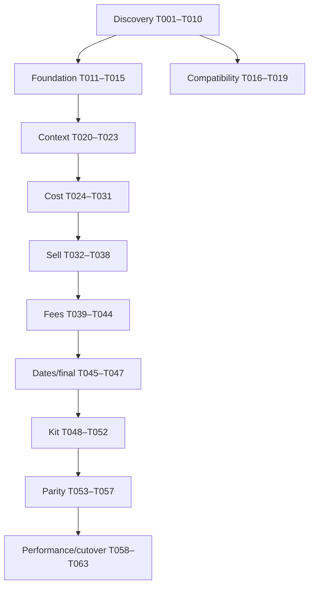

# Tasks: COBOL Pricing Modernization

## Conventions

- `[CLAUDE]`: Claude Code owns the work product.
- `[CODEX]`: Codex owns the implementation.
- `[SHARED]`: named owner executes; other agent reviews.
- `[P]`: may run in parallel with other tasks whose dependencies are satisfied.
- `[ ]` not started, `[~]` claimed/in progress, `[x]` complete, `[!]` blocked.
- Every task must satisfy `AGENTS.md` handoff requirements.

## Dependency Overview

## Phase 1 — Discovery and Evidence

- [x] T001 [CLAUDE] Create `docs/cobol-analysis/program-inventory.md` for every supplied CBL/CPY file, including purpose, interface, calls, copies, SQL includes, major paragraphs, errors, and missing dependencies.
  - Depends on: none
  - Acceptance: all supplied files and visible links/includes accounted for; regular and kit call graph included; confidence labels used.
  - Owner: Claude
  - Evidence: `docs/cobol-analysis/program-inventory.md`. Covers all files in `upload/` (26 source files: 9 programs, 16 copybooks, plus the `OMGPR_Field_Inventory.xlsx` reference workbook), including the four programs added mid-analysis (`A6O012U`, `A6O013U`, `A6O016U`, `CUP120`). CONFIRMED/INFERRED/BLOCKED labels used throughout; consolidated missing-dependency list in §7 (notably `A6O015U`, `CUS120`, `A6P001WB`, and ~135 DB2 tables with no supplied DCLGEN).

- [x] T002 [P] [CLAUDE] Create `docs/cobol-analysis/call-graph.md` with CICS links, request/response structures, routing conditions, and unresolved targets.
  - Depends on: none
  - Owner: Claude
  - Evidence: `docs/cobol-analysis/call-graph.md` — standalone artifact (not embedded in program-inventory.md), 7 edge-by-edge rules (R-CALL-001..007) re-verified directly from A6X01.CBL, A6O011U.CBL, CUP100's CUP120 call site, and A6U01's NDP call site (all re-read for this task, not carried forward from T001's summary), plus a consolidated unresolved-targets table. Findings include: A6X01's own header comment claims a conditional product-type lookup that the code no longer performs (now unconditional); the routing letter 'O' has three unrelated meanings across this codebase (kit-product-type here vs. two other domains elsewhere) disambiguated explicitly; A6O011U's exact 3-stage kit orchestration (category lookup, then explosion, then per-component pricing looped once per exploded item); two edges (A6U01->A6P001WB NDP call, CUP100->CUP120) are raw dynamic CALLs with no CICS-level failure trap, structurally different from every LINK-based edge; the NDP path's on/off feature-flag check is present in source but entirely commented out, so it now fires unconditionally; CUS120 (behind the CUP120 shell) is identified as the single largest evidence gap in the whole codebase since it's missing logic, not just schema.
  - Acceptance: caller/callee, COMMAREA, CICS response handling, and product-type routing documented.
  - Acceptance: caller/callee, COMMAREA, CICS response handling, and product-type routing documented.

- [x] T003 [P] [CLAUDE] Create `docs/mappings/omgpr-data-dictionary.csv` and `.md` with every field, PIC, storage, sign, scale, occurrence, classification, default, 88 values, proposed C# type, length, and offset/confidence.
  - Depends on: none
  - Acceptance: reconciles or explicitly explains the 1,789-byte layout; no unmarked guesses.
  - Owner: Claude
  - Evidence: `docs/mappings/omgpr-data-dictionary.md` + `.csv`. Both generated by mechanically parsing `upload/OMGPR.CPY` (not transcribed by hand). 287 leaf fields, 22 groups, 135 88-level conditions, 0 REDEFINES/OCCURS — cross-validated against the pre-existing `OMGPR_Field_Inventory.xlsx` workbook's own counts. Byte lengths/offsets independently recomputed via cited standard COBOL storage formulas; this recomputation found and corrected specific per-field errors in that workbook (documented in the "Reconciliation of the 1,789-byte layout" section) and **reverses its truncation-risk conclusion** — the record now computes to ~1,773-1,775 bytes, under the 1,789-byte hardcoded COMMAREA, not over it. Two fields marked `INFERRED` (binary `COMP` sizing convention ambiguity, ≤2 bytes total effect); everything else `CONFIRMED`.

- [x] T004 [P] [CLAUDE] Create `docs/mappings/omgexpl-data-dictionary.csv` and `docs/cobol-analysis/kit-processing.md`.
  - Depends on: none
  - Owner: Claude
  - Evidence: `docs/mappings/omgexpl-data-dictionary.csv` + `.md` (full field-by-field OMGEXPL layout, byte-length reconciled EXACTLY against A6O012U's 23,367-byte DFHCOMMAREA with zero slack, unlike OMGPR's ambiguous gap; OMGPK inferred by usage only, since OMGPK.CPY is not supplied) and `docs/cobol-analysis/kit-processing.md` (7 rules: R-KIT-001 input validation, R-KIT-002 three-way request-type dispatch producing genuinely different row sets per view, R-KIT-003 level-2 quantity rollup through parent sub-pack incl. a documented historical bug fix (incident #1667882), R-KIT-004 capacity limits with confirmed silent truncation and no overflow error unlike A6U01's convention, R-KIT-005 CICS LINK failure handling, R-KIT-006 expiration-date pass-through with no comparison logic, R-KIT-007 rollup-cost switch forwarded but not evaluated by this program). A6O015U (the actual explosion engine) and OMGPK.CPY remain BLOCKED, not supplied.
  - Acceptance: component capacity, quantity, UOM, level, sub-pack, rollup, errors, and expiration documented.
  - Acceptance: component capacity, quantity, UOM, level, sub-pack, rollup, errors, and expiration documented.

- [x] T005 [P] [CLAUDE] Create `docs/cobol-analysis/sql-query-inventory.csv` and `db2-table-inventory.md` for all visible SQL blocks and includes.
  - Depends on: none
  - Acceptance: host variables, date filters, ordering, SQLCODE paths, cursor lifecycle, and business purpose captured.
  - Owner: Claude
  - Evidence: `docs/cobol-analysis/sql-query-inventory.csv` (417 EXEC SQL blocks across 9 programs: 180 INCLUDE, 187 SELECT, 13 DECLARE CURSOR, 12 each OPEN/FETCH/CLOSE CURSOR, 1 unclassified; SQLCODE handling mechanically located for 208/237 (88%) of non-INCLUDE blocks, remainder left blank rather than guessed) and `docs/cobol-analysis/db2-table-inventory.md` (187 distinct tables in 11 families, DCLGEN-supplied vs. BLOCKED status per table, cross-referenced to prior decision-table findings where available). Flags one copybook-documentation error found during extraction: `HCOVDGRP.CPY`/`HCOVDGPD.CPY` header comments both claim table `HC_OVRD_PROD_GROUP`, but SQL- and host-variable-confirmed real names are `HC_OVRD_GROUP_HEADER`/`HC_OVRD_GROUP_DETAIL`.

- [x] T006 [P] [CLAUDE] Create `docs/cobol-analysis/error-catalog.md` mapping validation, SQL, CICS, kit, and component error paths to OMGPR fields.
  - Depends on: T001
  - Owner: Claude
  - Evidence: `docs/cobol-analysis/error-catalog.md` — mechanically scanned all 213 OMGPR-Q-ERROR-NBR/WS-DB-ERROR-NBR assignment sites in A6U01.CBL (183 distinct codes), each classified STOP/CONTINUE by presence of GO TO 0020-EXIT-PRICER, plus narrative sections for validation errors (102-105 missing-input family incl. a confirmed message/code copy-paste bug, 112/115-119 pricing-method-invalid family, 124 vs 135 BG-price-parameter errors, 601-603), a limit/overflow family with inconsistent severity (142 fatal vs 145 not vs 701-703 fatal), Surcharge's entirely separate/siloed error mechanism (invisible to the standard OMGPR-Q-ERROR-NBR scan, itself with a further internal hard/soft split), CICS LINK handling, and kit/component error spaces (A6O012U/013U/016U, the A6R10/13/16 response-flag pattern), plus a full 183-row appendix table. Key finding: OMGPR-Q-ERROR-NBR (specific code, 1-1026) and OMGPR-Q-ERROR-CODE (severity bucket, 0-99) are independently assigned fields, not one scale — 182 of 183 fatal paths hardcode the severity bucket to the same constant (70) regardless of the specific error number.
  - Acceptance: error numbers/codes/messages and stop/continue behavior documented.
  - Acceptance: error numbers/codes/messages and stop/continue behavior documented.

- [x] T007 [CLAUDE] Create `docs/rules/cost-selection-rules.md` as an ordered decision table starting from A6U01 cost control paragraphs and all transitive paragraphs.
  - Depends on: T001, T005
  - Owner: Claude
  - Evidence: `docs/rules/cost-selection-rules.md` — 11 rules (R-COST-000..005, R-SPECIAL-001, R-HC-001..002, R-ACQ-001..002) across 5 areas, each in CLAUDE.md's 11-element format, plus a 7-item cross-cutting-findings section. Resolves a blocker left open in T009 (`7105-SEL-PRC-LST-010`'s internals, cited BLOCKED in R-REBATE-000). Findings include: individual contract tried before group, first-match-wins with no combining; a contract found by SQL can still be rejected by a separate exclusion check; special-contract mode restricts individual-contract eligibility to bypass-flagged rows and skips the account-level rounding stage; the buy-group priority walk is a nested two-level cascade (priority level outer, child-then-ancestor-climb inner); healthcare override only activates when no contract was found at all; three independent and mutually-inconsistent "duplicate row" tie-break conventions exist in this codebase (lowest-cost for individual contracts, highest-acquisition-cost for healthcare price lists, latest-effective-date for the general price-list fallback).
  - Acceptance: individual, account/customer, group, parent, special, healthcare, and acquisition fallback paths covered where evidenced.

- [x] T008 [P] [CLAUDE] Create `docs/rules/sell-selection-rules.md` with hierarchy, formulas, price lock, and list-price fallback.
  - Depends on: T001, T005
  - Owner: Claude
  - Evidence: `docs/rules/sell-selection-rules.md` — 8 rules (R-SELL-001..005, R-LOCK-001..003), each in CLAUDE.md's 11-element format, plus a 6-item cross-cutting-findings section. Three rules (R-SELL-001..003) re-verify and carry forward prior work against the identical (MD5-matched) A6U01.CBL; the other five are new extractions filling gaps the prior work explicitly left open (the group-contract-linked and acquisition-cost-linked sell cascades, and the entire price-lock mechanism, absent from prior work despite being named in this task's own title). Findings include: three independently-coded sell-arrangement cascades share a common idiom but differ in which tiers exist (only the individual-contract cascade has a corporate tier; only individual- and group-contract cascades have a vendor-contract-override tier); a found corporate-level match is silently overridden by a group-level match checked afterward; a healthcare sell-override can replace the price at two different pipeline points, both now traced end-to-end (setter and consumer); price-lock reconciliation runs after normal computation, not instead of it, and only two paragraphs (surcharge, vendor-cost-adjustment) are lock-aware, exhaustively verified; the gross-margin/markup-bucket formula was independently corroborated by two separate extraction passes (this task and T009) arriving at byte-identical results.
  - Acceptance: account, customer, contract, group, parent, corporate, product, category, vendor, and default paths covered.

- [x] T009 [P] [CLAUDE] Create `docs/rules/fees-and-adjustments.md` covering rebates, freight, JIT, PANDAC, SurgiTrak, low-UOM, break-bulk, label/application, delivery, surcharge, distribution, and markup.
  - Depends on: T001, T005
  - Owner: Claude
  - Evidence: `docs/rules/fees-and-adjustments.md` — 37 ordered rules (R-REBATE-000..006, R-FREIGHT-000..006, R-JIT-001..006, R-PANDAC-000..003, R-SURGITRAK-001..002, R-LUOM-001..005, R-DELIVERY-001..002, R-SURCHARGE-001..002, R-DISTMKP-001..002) across 10 fee areas, each in CLAUDE.md's 11-element format, plus an 8-item cross-cutting-findings section. Two areas (JIT, low-UOM/break-bulk) re-verify and carry forward prior decision-table work against the identical (MD5-matched) A6U01.CBL; the other eight are new extractions. Findings include: label/application has no independent computation (fully subsumed by JIT, documented as a negative finding rather than a gap); distribution/markup is one combined mechanism, not two; the customer-classification cascade (custom/group-sanctioned/division-01/individual/non-contract) is independently coded at least 3 times; rebate options #1-3 use last-write-wins overwrite (reverse of their comment-numbered priority); billing-frequency fold-in is directionally inconsistent across fee areas; surcharge is the only fee area whose WHEN OTHER does not abend the pricer; surcharge is the only fee area whose amount COMPUTE omits ROUNDED; PANDAC's live code silently dropped an early-exit its own header comment still describes.
  - Acceptance: eligibility, priority, exemptions, calculation, dates, outputs, and errors per rule.

- [x] T010 [P] [CLAUDE] Create `docs/rules/date-selection.md`, `rounding.md`, and `docs/characterization/scenario-catalog.md`.
  - Depends on: T001, T005
  - Owner: Claude
  - Evidence: `docs/rules/date-selection.md` (4 rules: null-indicator convention, inclusive-both-ends effective/expiration boundary, closest-expiration accumulator `7695-ADD-EXP-DATE-ARRA-010` + resolver `7720-PRO-EXPIRE-DATES-010`, and pricing-date derivation/mode-coverage — flags a silent array-overflow error path and JIT-ON-COST bypassing date resolution entirely); `docs/rules/rounding.md` (2 rules: the account-configurable final-stage rounding `7715-PRO-ROUNDING-010` with 3 modes including a `0.0049`-bias "ceiling to the cent" mode, and the pervasive intermediate `COMPUTE...ROUNDED` convention with Surcharge as the sole confirmed non-rounding exception — flags that the platform's default rounding-tie behavior is INFERRED, not confirmed, since no `ROUNDED MODE` clause appears anywhere in the source); `docs/characterization/scenario-catalog.md` (17 scenarios: 9 date-boundary, 7 rounding, 3 cross-fee illustrative, each traced to a governing rule ID with CONFIRMED/INFERRED labeling — explicitly scoped to date/rounding only, not a full T007/T008/T009 scenario matrix since T007/T008 don't exist yet).
  - Acceptance: boundary behavior, null dates, closest expiration, rounding stages, and minimum scenario matrix documented.

### Gate G1 — Discovery Review

- [x] G1 [SHARED] Codex reviews T001–T010 for implementability; Claude resolves evidence gaps or marks blockers. No pricing-rule implementation starts before approval.
  - Owner: Codex
  - Reviewer: Codex
  - Review: `docs/reviews/g1-implementability-review.md` (currently only on local disk in the `omni-codex` worktree, not yet committed/pushed — content independently verified by Claude by reading the file directly)
  - Evidence: Codex re-reviewed T001–T010 directly from `origin/agent/claude-discovery` at `ff0c9f0e31e0dd85055c2ef8a62033fa2ffb21e6`; decision is APPROVED WITH SCOPED DOWNSTREAM BLOCKERS. Each prior gap is classified per-task as resolved, partially resolved with a named downstream blocker, or explicitly BLOCKED due to unavailable source (accepted per this repo's own conventions, not treated as a rejection reason). Scoped downstream blockers recorded: (1) preserve BLOCKED status for A6O015U/CUS120/A6P001WB/CUR120/OMGPK/missing DCLGENs, (2) reconcile the OMGPR 1,789-byte contract against a live compiler layout before compatibility decoding begins — relevant to T016/T018, (3) confirm platform rounding-tie mode before using T010's scenarios for parity acceptance, (4) keep OMGPK/A6O015U/CUS120/A6P001WB internals blocked until authoritative sources exist.

## Phase 2 — .NET Foundation

- [ ] T011 [P] [CODEX] Create the .NET 8 solution and projects from `plan.md` with central package management, nullable references, analyzers, and baseline tests.
  - Depends on: none
  - Acceptance: clean restore/build/test; dependency direction documented and enforced.

- [ ] T012 [P] [CODEX] Configure Pricing.Api with OpenAPI, ProblemDetails, health checks, structured logging, OpenTelemetry, correlation, and cancellation.
  - Depends on: T011
  - Acceptance: API starts; health/OpenAPI available; smoke tests pass.

- [ ] T013 [P] [CODEX] Implement domain value objects: Money, Percentage, identifiers, UOM, Quantity, and PricingDateRange.
  - Depends on: T011, T003 reviewed
  - Acceptance: immutable; decimal-only; validation, equality, serialization, and boundary tests.

- [ ] T014 [P] [CODEX] Implement PricingRequest, PricingContext, PricingResult, ProductInformation, CustomerInformation, ContractSelection, SellArrangementSelection, PriceComponent, and typed errors.
  - Depends on: T011, T013
  - Acceptance: models separate input/context/output and retain provenance.

- [ ] T015 [CODEX] Add CI workflow for formatting, restore, build, tests, analyzers, dependency audit, and test artifacts.
  - Depends on: T011
  - Acceptance: workflow syntax validated; local equivalents documented.

## Phase 3 — OMGPR Compatibility

- [x] T016 [CLAUDE] Produce `docs/mappings/omgpr-test-vectors.json` with confirmed positive, negative, zero, scale, spaces, low values, and error-field cases.
  - Depends on: T003, G1
  - Owner: Claude
  - Evidence: `docs/mappings/omgpr-test-vectors.json` — 23 vectors across 8 representative fields spanning every OMGPR storage type (DISPLAY alphanumeric, DISPLAY date-as-text, COMP binary at two sizes, signed and unsigned COMP-3, dedicated error-output fields), each citing its copybook group path/PIC/offset from the T003 data dictionary. All numeric/binary byte values independently verified via script (Python's cp037 EBCDIC codec, struct.pack two's-complement), not hand-computed-and-trusted. Encoding is parameterized across two explicit, named profiles (mainframe_ebcdic default vs. microfocus_ascii_native alternate) rather than one hardcoded assumption, grounded in direct in-source evidence (pervasive MFMIGR change-tags confirming a historical Micro Focus migration occurred) rather than a hypothetical. Flags OMGPR-I-CONTRACT (the field Codex's G1 review specifically named) with dedicated positive/negative/zero vectors, and notes the field's true encoding profile remains an open question pending live capture — matching Codex's own G1 downstream blocker #2 verbatim.
  - Acceptance: every vector cites copybook definition; unknown encoding/byte order parameterized.

- [ ] T017 [CODEX] Implement configurable alphanumeric, COMP, and COMP-3 primitives in Pricing.Compatibility.
  - Depends on: T011, T003, T016
  - Acceptance: valid/invalid, signs, scales, byte order, overflow, and cancellation-independent deterministic tests.

- [ ] T018 [CODEX] Implement 1,789-byte OMGPR decoder and map legacy input to PricingRequest.
  - Depends on: T014, T017
  - Acceptance: length validation; centralized offsets; vectors pass; no legacy binary concerns leak into domain.

- [ ] T019 [CODEX] Implement PricingResult-to-OMGPR encoder and round-trip tests.
  - Depends on: T018
  - Acceptance: exact output length; preserved required input fields; legacy error fields mapped; test vectors pass.

### Gate G2 — Compatibility Review

- [ ] G2 [SHARED] Claude reviews codecs against copybooks and vectors; Codex resolves findings. Encoding and byte order must be confirmed or remain deployment blockers.

## Phase 4 — Product and Customer Context

- [ ] T020 [CODEX] Implement ProductClassificationService based on A6O010U behavior.
  - Depends on: T014, G1
  - Acceptance: missing vendor/product, regular, kit type O, not found, database failure, and cancellation tests.

- [ ] T021 [CODEX] Implement ProductInformationService contract and repository for category, inventory class, base/alternate UOM, conversion, and dates.
  - Depends on: T014, T005
  - Acceptance: inferred A6O013U behavior isolated and feature-blocked until confirmed.

- [ ] T022 [CODEX] Implement CustomerPricingContextService contracts and orchestration based on CUP100 analysis.
  - Depends on: T014, T005, G1
  - Acceptance: account/customer, memberships, parents, priorities, exclusions, fees, low-UOM, freight, and components represented.

- [ ] T023 [P] [CODEX] Implement DB2 access infrastructure, connection health, transient-error mapping, query tracing, and integration-test fixtures.
  - Depends on: T011, T005
  - Acceptance: business-oriented repository boundaries; parameterized SQL; no production credentials; SQL and cancellation tests.

## Phase 5 — Cost Engine

- [ ] T024 [CODEX] Implement ordered ICostRule framework, evaluator, trace, skip reasons, provenance, and duplicate-priority validation.
  - Depends on: T014, T007, T022
  - Acceptance: deterministic ordering; first applicable rule semantics; full trace tests.

- [ ] T025 [P] [CODEX] Implement individual and account/customer cost-contract rules.
  - Depends on: T024, T023
  - Acceptance: applies/non-applies/excluded/expired/zero/competitor/fallback tests per rule.

- [ ] T026 [P] [CODEX] Implement primary, other, and parent buying-group cost rules.
  - Depends on: T024, T023
  - Acceptance: membership and priority hierarchy parity tests.

- [ ] T027 [P] [CODEX] Implement special-contract cost behavior.
  - Depends on: T024, T007
  - Acceptance: special path, early exit, rounding, and expiration verified.

- [ ] T028 [P] [CODEX] Implement healthcare override cost rule using HCOVD structures.
  - Depends on: T024, T023
  - Acceptance: account/CID/group/product/date/type/percent/fixed cases.

- [ ] T029 [CODEX] Implement acquisition/dealer-cost fallback as last cost rule.
  - Depends on: T025–T028
  - Acceptance: only runs after all higher rules fail; exemption resets match COBOL.

- [ ] T030 [CODEX] Implement rebate calculators and contract-entry-method exceptions.
  - Depends on: T024, T009
  - Acceptance: normal, methods 06/08, zero, negative, max, protected acquisition, and expiration tests.

- [ ] T031 [CODEX] Implement vendor cost adjustments and cost-side adjustment composition.
  - Depends on: T024, T009, T030
  - Acceptance: ordered composition, failure propagation, provenance, and parity fixtures.

### Gate G3 — Cost Parity

- [ ] G3 [SHARED] Run approved cost scenarios and require exact critical-field parity before sell implementation is declared complete.

## Phase 6 — Sell Engine

- [ ] T032 [CODEX] Implement ordered ISellArrangementRule framework and calculation-strategy contracts.
  - Depends on: T014, T008, T029
  - Acceptance: deterministic priority, trace, provenance, and no-arrangement behavior.

- [ ] T033 [P] [CODEX] Implement account and customer-number sell rules.
  - Depends on: T032

- [ ] T034 [P] [CODEX] Implement individual-contract and buying-group/parent sell rules.
  - Depends on: T032

- [ ] T035 [P] [CODEX] Implement corporate, product, category, vendor, and default sell rules.
  - Depends on: T032

- [ ] T036 [CODEX] Implement fixed, stated, cost-plus, cost-discount, gross-margin, suggested-sell, and list-price calculators.
  - Depends on: T032, T010
  - Acceptance: formula, scale, zero, negative guard where applicable, and rounding tests.

- [ ] T037 [CODEX] Implement price-lock behavior and tests.
  - Depends on: T033–T036

- [ ] T038 [CODEX] Implement sell adjustments and compose base sell, adjustments, and provenance.
  - Depends on: T037, T009

## Phase 7 — Fees and Surcharges

- [ ] T039 [P] [CODEX] Implement freight engine with account-first priority and single-source winner semantics.
  - Depends on: T009, T023, T031

- [ ] T040 [P] [CODEX] Implement JIT engine for A/C/P/R behaviors and exemptions.
  - Depends on: T009, T031, T038

- [ ] T041 [P] [CODEX] Implement low-UOM and break-bulk engines including eligibility, vendor/contract exclusions, group hierarchy, alt UOM, and zero percentage.
  - Depends on: T009, T023

- [ ] T042 [P] [CODEX] Implement PANDAC and SurgiTrak behavior including implied sell arrangement where evidenced.
  - Depends on: T009, T038

- [ ] T043 [P] [CODEX] Implement label, application, extra-delivery, and distribution fees.
  - Depends on: T009, T023

- [ ] T044 [CODEX] Implement category surcharge and sanctioned/non-sanctioned/individual/non-contract/customer markup composition.
  - Depends on: T009, T038

## Phase 8 — Dates, Rounding, and Final Result

- [ ] T045 [CODEX] Implement ExpirationDateCollector with source provenance and closest-valid-date logic.
  - Depends on: T010
  - Acceptance: null, duplicate, expired, same-day, leap-day, competing, and component tests.

- [ ] T046 [CODEX] Implement COBOL-compatible rounding policy and account configuration.
  - Depends on: T010, T013
  - Acceptance: proves stage-sensitive cases and all supported modes.

- [ ] T047 [CODEX] Implement PricingOrchestrator and PricingResultFactory across context, cost, rebate, sell, fees, rounding, expiration, warnings, and errors.
  - Depends on: T031, T038–T046
  - Acceptance: full regular-item scenario tests and explainable output.

## Phase 9 — Kit Pricing

- [ ] T048 [CLAUDE] Finalize confirmed kit decision table after missing A6O012U/A6O013U sources or interface evidence is obtained.
  - Depends on: T004
  - Acceptance: every inferred behavior resolved or explicitly blocked.

- [ ] T049 [CODEX] Implement IKitExplosionRepository, initially wrapping the legacy dependency when reimplementation evidence is incomplete.
  - Depends on: T048, T023

- [ ] T050 [CODEX] Implement component pricing loop through regular PricingOrchestrator with recursion/cycle/depth protection.
  - Depends on: T047, T049

- [ ] T051 [CODEX] Implement kit rollup for quantities, costs, rebates, adjustments, freight, JIT, vendor adjustments, overhead, third-party fees, and sell.
  - Depends on: T050, T004

- [ ] T052 [CODEX] Implement kit alternative-UOM conversion, earliest expiration, and component error propagation.
  - Depends on: T045, T046, T051

### Gate G4 — Kit Parity

- [ ] G4 [SHARED] Compare approved component and rollup cases; critical fields and decision paths must match.

## Phase 10 — API and Parity Operations

- [ ] T053 [CODEX] Implement `POST /api/v1/prices/calculate` from the OpenAPI contract with regular/kit routing and all request modes.
  - Depends on: T047, T052

- [ ] T054 [CODEX] Implement validation, ProblemDetails, modern/legacy error mapping, authentication/authorization hooks, rate/input limits, and audit correlation.
  - Depends on: T006, T012, T053

- [ ] T055 [CLAUDE] Produce sanitized COBOL characterization fixtures with expected decision paths and critical outputs.
  - Depends on: T006–T010

- [ ] T056 [CODEX] Build ParityRunner to invoke COBOL adapter and C# service for identical inputs and persist comparison results.
  - Depends on: T019, T047, T052, T055

- [ ] T057 [CODEX] Implement difference classification: exact, rounding, rule, missing/additional fee, date, contract, error, and missing-data differences.
  - Depends on: T056
  - Acceptance: rule/contract mismatch is critical even if totals match.

## Phase 11 — Performance, Shadow, and Cutover

- [ ] T058 [CLAUDE] Document COBOL performance baseline method and representative workload dimensions.
  - Depends on: T055

- [ ] T059 [CODEX] Implement performance/load tests and report DB calls, latency percentiles, throughput, memory, error rate, and kit-size effects.
  - Depends on: T053, T058

- [ ] T060 [CODEX] Optimize verified hotspots using indexes/query changes/batching/request caching without changing results.
  - Depends on: T057, T059
  - Acceptance: parity suite unchanged; cache keys include every pricing determinant and pricing date.

- [ ] T061 [CODEX] Implement shadow execution, sampling, metrics, safe difference logs, dashboards/alerts definitions, and COBOL-authoritative response selection.
  - Depends on: T057, T060

- [ ] T062 [CODEX] Implement scoped cutover flags by division/customer/product/request type/traffic percentage and immediate COBOL rollback.
  - Depends on: T061

- [ ] T063 [SHARED] Produce cutover runbook, support guide, approval checklist, rollback drill evidence, and final parity/performance report.
  - Depends on: T061, T062

## Final Definition of Done

- All constitutional delivery gates approved.
- All confirmed legacy behavior traced and tested.
- No unresolved blocker affects the pilot scope.
- Critical parity is exact for the approved suite and shadow window.
- Security, observability, performance, rollback, and support readiness approved.
- COBOL retirement is a separate, explicitly approved specification.

