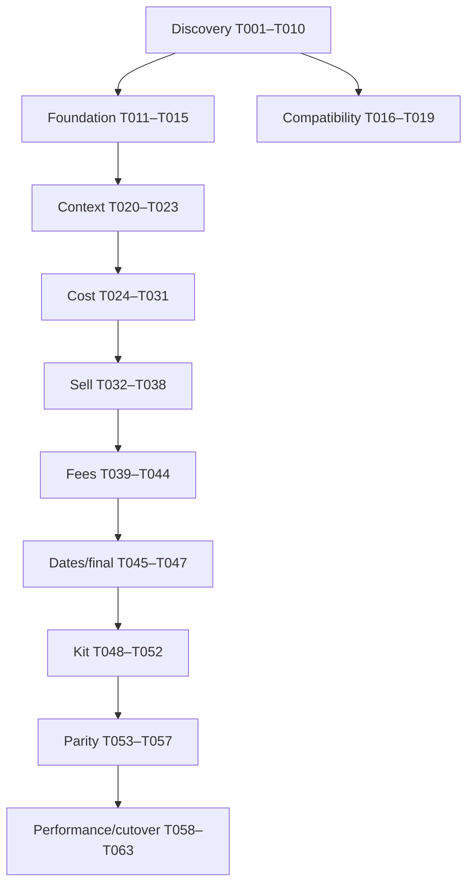

# Tasks: COBOL Pricing Modernization

## Conventions

- `[CLAUDE]`: Claude Code owns the work product.
- `[CODEX]`: Codex owns the implementation.
- `[SHARED]`: named owner executes; other agent reviews.
- `[P]`: may run in parallel with other tasks whose dependencies are satisfied.
- `[ ]` not started, `[~]` claimed/in progress, `[x]` complete, `[!]` blocked.
- Every task must satisfy `AGENTS.md` handoff requirements.

## Dependency Overview

## Phase 1 — Discovery and Evidence

- [x] T001 [CLAUDE] Create `docs/cobol-analysis/program-inventory.md` for every supplied CBL/CPY file, including purpose, interface, calls, copies, SQL includes, major paragraphs, errors, and missing dependencies.
  - Depends on: none
  - Acceptance: all supplied files and visible links/includes accounted for; regular and kit call graph included; confidence labels used.
  - Owner: Claude
  - Evidence: `docs/cobol-analysis/program-inventory.md`. Covers all files in `upload/` (26 source files: 9 programs, 16 copybooks, plus the `OMGPR_Field_Inventory.xlsx` reference workbook), including the four programs added mid-analysis (`A6O012U`, `A6O013U`, `A6O016U`, `CUP120`). CONFIRMED/INFERRED/BLOCKED labels used throughout; consolidated missing-dependency list in §7 (notably `A6O015U`, `CUS120`, `A6P001WB`, and ~135 DB2 tables with no supplied DCLGEN).
  - Evidence update (2026-07-20, second upload batch): 22 new files supplied (`BGG03/23/24.CPY`, `CCG25.CPY`, `CUG02/03/06/07/10/11/17/40/41/53.CPY`, `CUR120.CPY`, `CUVMST.CPY`, `VNG02/05.CPY`, `DFHRESP.CPY`, `SQLCA.CPY`, clean re-uploads of `A6O010U.CBL`/`CUP100.CBL`). All read in full; §4.2/§7 updated — 18 tables moved from BLOCKED to RESOLVED (`CUR120`, `CUTMST` via `CUVMST.CPY`, and 16 DB2 DCLGENs). `A6O015U`, `CUS120`, `A6P001WB`, `OMGPK`, and the ~115 remaining DCLGENs (full list still in §4.2) remain BLOCKED.

- [x] T002 [P] [CLAUDE] Create `docs/cobol-analysis/call-graph.md` with CICS links, request/response structures, routing conditions, and unresolved targets.
  - Depends on: none
  - Owner: Claude
  - Evidence: `docs/cobol-analysis/call-graph.md` — standalone artifact (not embedded in program-inventory.md), 7 edge-by-edge rules (R-CALL-001..007) re-verified directly from A6X01.CBL, A6O011U.CBL, CUP100's CUP120 call site, and A6U01's NDP call site (all re-read for this task, not carried forward from T001's summary), plus a consolidated unresolved-targets table. Findings include: A6X01's own header comment claims a conditional product-type lookup that the code no longer performs (now unconditional); the routing letter 'O' has three unrelated meanings across this codebase (kit-product-type here vs. two other domains elsewhere) disambiguated explicitly; A6O011U's exact 3-stage kit orchestration (category lookup, then explosion, then per-component pricing looped once per exploded item); two edges (A6U01->A6P001WB NDP call, CUP100->CUP120) are raw dynamic CALLs with no CICS-level failure trap, structurally different from every LINK-based edge; the NDP path's on/off feature-flag check is present in source but entirely commented out, so it now fires unconditionally; CUS120 (behind the CUP120 shell) is identified as the single largest evidence gap in the whole codebase since it's missing logic, not just schema.
  - Acceptance: caller/callee, COMMAREA, CICS response handling, and product-type routing documented.
  - Acceptance: caller/callee, COMMAREA, CICS response handling, and product-type routing documented.

- [x] T003 [P] [CLAUDE] Create `docs/mappings/omgpr-data-dictionary.csv` and `.md` with every field, PIC, storage, sign, scale, occurrence, classification, default, 88 values, proposed C# type, length, and offset/confidence.
  - Depends on: none
  - Acceptance: reconciles or explicitly explains the 1,789-byte layout; no unmarked guesses.
  - Owner: Claude
  - Evidence: `docs/mappings/omgpr-data-dictionary.md` + `.csv`. Both generated by mechanically parsing `upload/OMGPR.CPY` (not transcribed by hand). 287 leaf fields, 22 groups, 135 88-level conditions, 0 REDEFINES/OCCURS — cross-validated against the pre-existing `OMGPR_Field_Inventory.xlsx` workbook's own counts. Byte lengths/offsets independently recomputed via cited standard COBOL storage formulas; this recomputation found and corrected specific per-field errors in that workbook (documented in the "Reconciliation of the 1,789-byte layout" section) and **reverses its truncation-risk conclusion** — the record now computes to ~1,773-1,775 bytes, under the 1,789-byte hardcoded COMMAREA, not over it. Two fields marked `INFERRED` (binary `COMP` sizing convention ambiguity, ≤2 bytes total effect); everything else `CONFIRMED`.

- [x] T004 [P] [CLAUDE] Create `docs/mappings/omgexpl-data-dictionary.csv` and `docs/cobol-analysis/kit-processing.md`.
  - Depends on: none
  - Owner: Claude
  - Evidence: `docs/mappings/omgexpl-data-dictionary.csv` + `.md` (full field-by-field OMGEXPL layout, byte-length reconciled EXACTLY against A6O012U's 23,367-byte DFHCOMMAREA with zero slack, unlike OMGPR's ambiguous gap; OMGPK inferred by usage only, since OMGPK.CPY is not supplied) and `docs/cobol-analysis/kit-processing.md` (7 rules: R-KIT-001 input validation, R-KIT-002 three-way request-type dispatch producing genuinely different row sets per view, R-KIT-003 level-2 quantity rollup through parent sub-pack incl. a documented historical bug fix (incident #1667882), R-KIT-004 capacity limits with confirmed silent truncation and no overflow error unlike A6U01's convention, R-KIT-005 CICS LINK failure handling, R-KIT-006 expiration-date pass-through with no comparison logic, R-KIT-007 rollup-cost switch forwarded but not evaluated by this program). A6O015U (the actual explosion engine) and OMGPK.CPY remain BLOCKED, not supplied.
  - Acceptance: component capacity, quantity, UOM, level, sub-pack, rollup, errors, and expiration documented.
  - Acceptance: component capacity, quantity, UOM, level, sub-pack, rollup, errors, and expiration documented.

- [x] T005 [P] [CLAUDE] Create `docs/cobol-analysis/sql-query-inventory.csv` and `db2-table-inventory.md` for all visible SQL blocks and includes.
  - Depends on: none
  - Acceptance: host variables, date filters, ordering, SQLCODE paths, cursor lifecycle, and business purpose captured.
  - Owner: Claude
  - Evidence: `docs/cobol-analysis/sql-query-inventory.csv` (417 EXEC SQL blocks across 9 programs: 180 INCLUDE, 187 SELECT, 13 DECLARE CURSOR, 12 each OPEN/FETCH/CLOSE CURSOR, 1 unclassified; SQLCODE handling mechanically located for 208/237 (88%) of non-INCLUDE blocks, remainder left blank rather than guessed) and `docs/cobol-analysis/db2-table-inventory.md` (187 distinct tables in 11 families, DCLGEN-supplied vs. BLOCKED status per table, cross-referenced to prior decision-table findings where available). Flags one copybook-documentation error found during extraction: `HCOVDGRP.CPY`/`HCOVDGPD.CPY` header comments both claim table `HC_OVRD_PROD_GROUP`, but SQL- and host-variable-confirmed real names are `HC_OVRD_GROUP_HEADER`/`HC_OVRD_GROUP_DETAIL`.
  - Evidence update (2026-07-20, second upload batch): 18 rows in `db2-table-inventory.md` moved BLOCKED -> SUPPLIED (`BGG03`, `BGG23`, `BGG24`, `CCG25`, `CUG02/03/06/07/10/11/17/40/41/53`, `CUR120`, `CUTMST`, `VNG02`, `VNG05`), each annotated with the supplying `.CPY` filename. `CUTMST`/`CUVMST.CPY` flagged as the one exception with no `EXEC SQL DECLARE` block (plain working-storage layout, storage mechanism VSAM-vs-DB2 still unconfirmed).

- [x] T006 [P] [CLAUDE] Create `docs/cobol-analysis/error-catalog.md` mapping validation, SQL, CICS, kit, and component error paths to OMGPR fields.
  - Depends on: T001
  - Owner: Claude
  - Evidence: `docs/cobol-analysis/error-catalog.md` — mechanically scanned all 213 OMGPR-Q-ERROR-NBR/WS-DB-ERROR-NBR assignment sites in A6U01.CBL (183 distinct codes), each classified STOP/CONTINUE by presence of GO TO 0020-EXIT-PRICER, plus narrative sections for validation errors (102-105 missing-input family incl. a confirmed message/code copy-paste bug, 112/115-119 pricing-method-invalid family, 124 vs 135 BG-price-parameter errors, 601-603), a limit/overflow family with inconsistent severity (142 fatal vs 145 not vs 701-703 fatal), Surcharge's entirely separate/siloed error mechanism (invisible to the standard OMGPR-Q-ERROR-NBR scan, itself with a further internal hard/soft split), CICS LINK handling, and kit/component error spaces (A6O012U/013U/016U, the A6R10/13/16 response-flag pattern), plus a full 183-row appendix table. Key finding: OMGPR-Q-ERROR-NBR (specific code, 1-1026) and OMGPR-Q-ERROR-CODE (severity bucket, 0-99) are independently assigned fields, not one scale — 182 of 183 fatal paths hardcode the severity bucket to the same constant (70) regardless of the specific error number.
  - Acceptance: error numbers/codes/messages and stop/continue behavior documented.
  - Acceptance: error numbers/codes/messages and stop/continue behavior documented.

- [x] T007 [CLAUDE] Create `docs/rules/cost-selection-rules.md` as an ordered decision table starting from A6U01 cost control paragraphs and all transitive paragraphs.
  - Depends on: T001, T005
  - Owner: Claude
  - Evidence: `docs/rules/cost-selection-rules.md` — 11 rules (R-COST-000..005, R-SPECIAL-001, R-HC-001..002, R-ACQ-001..002) across 5 areas, each in CLAUDE.md's 11-element format, plus a 7-item cross-cutting-findings section. Resolves a blocker left open in T009 (`7105-SEL-PRC-LST-010`'s internals, cited BLOCKED in R-REBATE-000). Findings include: individual contract tried before group, first-match-wins with no combining; a contract found by SQL can still be rejected by a separate exclusion check; special-contract mode restricts individual-contract eligibility to bypass-flagged rows and skips the account-level rounding stage; the buy-group priority walk is a nested two-level cascade (priority level outer, child-then-ancestor-climb inner); healthcare override only activates when no contract was found at all; three independent and mutually-inconsistent "duplicate row" tie-break conventions exist in this codebase (lowest-cost for individual contracts, highest-acquisition-cost for healthcare price lists, latest-effective-date for the general price-list fallback).
  - Evidence update (2026-07-20, second upload batch): field-level confidence upgraded from usage-only to CONFIRMED for `CCG25` (R-COST-001 item 9, contract exclusion), `CUG06/07/10/11` and `BGG03` (R-COST-003/004/005, buy-group priority walk and parent climb) — exact PIC-level shapes now cited from the supplied DCLGENs. No rule behavior changed, only evidence confidence.
  - Acceptance: individual, account/customer, group, parent, special, healthcare, and acquisition fallback paths covered where evidenced.

- [x] T008 [P] [CLAUDE] Create `docs/rules/sell-selection-rules.md` with hierarchy, formulas, price lock, and list-price fallback.
  - Depends on: T001, T005
  - Owner: Claude
  - Evidence: `docs/rules/sell-selection-rules.md` — 8 rules (R-SELL-001..005, R-LOCK-001..003), each in CLAUDE.md's 11-element format, plus a 6-item cross-cutting-findings section. Three rules (R-SELL-001..003) re-verify and carry forward prior work against the identical (MD5-matched) A6U01.CBL; the other five are new extractions filling gaps the prior work explicitly left open (the group-contract-linked and acquisition-cost-linked sell cascades, and the entire price-lock mechanism, absent from prior work despite being named in this task's own title). Findings include: three independently-coded sell-arrangement cascades share a common idiom but differ in which tiers exist (only the individual-contract cascade has a corporate tier; only individual- and group-contract cascades have a vendor-contract-override tier); a found corporate-level match is silently overridden by a group-level match checked afterward; a healthcare sell-override can replace the price at two different pipeline points, both now traced end-to-end (setter and consumer); price-lock reconciliation runs after normal computation, not instead of it, and only two paragraphs (surcharge, vendor-cost-adjustment) are lock-aware, exhaustively verified; the gross-margin/markup-bucket formula was independently corroborated by two separate extraction passes (this task and T009) arriving at byte-identical results.
  - Evidence update (2026-07-20, second upload batch): `CUG03-C-ACCT-PRCE-METHOD`'s 88-level domain (`AU`/`ST`/`CC`) now CONFIRMED as the exact source of `OMGPR-C-ACCT-PRCE-METHOD` (R-SELL-003 item 10), resolving a standing blocker on whether the #602/#603 defensive-error guards are reachable. `VNG02-C-CUSTOM-IND` field shape confirmed (value semantics still not). `CUG06/07/10/11`, `BGG03`, `VNG02` field shapes confirmed throughout (R-SELL-001/002).
  - Acceptance: account, customer, contract, group, parent, corporate, product, category, vendor, and default paths covered.

- [x] T009 [P] [CLAUDE] Create `docs/rules/fees-and-adjustments.md` covering rebates, freight, JIT, PANDAC, SurgiTrak, low-UOM, break-bulk, label/application, delivery, surcharge, distribution, and markup.
  - Depends on: T001, T005
  - Owner: Claude
  - Evidence: `docs/rules/fees-and-adjustments.md` — 37 ordered rules (R-REBATE-000..006, R-FREIGHT-000..006, R-JIT-001..006, R-PANDAC-000..003, R-SURGITRAK-001..002, R-LUOM-001..005, R-DELIVERY-001..002, R-SURCHARGE-001..002, R-DISTMKP-001..002) across 10 fee areas, each in CLAUDE.md's 11-element format, plus an 8-item cross-cutting-findings section. Two areas (JIT, low-UOM/break-bulk) re-verify and carry forward prior decision-table work against the identical (MD5-matched) A6U01.CBL; the other eight are new extractions. Findings include: label/application has no independent computation (fully subsumed by JIT, documented as a negative finding rather than a gap); distribution/markup is one combined mechanism, not two; the customer-classification cascade (custom/group-sanctioned/division-01/individual/non-contract) is independently coded at least 3 times; rebate options #1-3 use last-write-wins overwrite (reverse of their comment-numbered priority); billing-frequency fold-in is directionally inconsistent across fee areas; surcharge is the only fee area whose WHEN OTHER does not abend the pricer; surcharge is the only fee area whose amount COMPUTE omits ROUNDED; PANDAC's live code silently dropped an early-exit its own header comment still describes.
  - Evidence update (2026-07-20, second upload batch): `CUR120.CPY` now supplied and read in full — confirms exact field shapes for every JIT/CMF fee-component field previously carried as usage-only (R-JIT-001/002/003, all 4 JIT percentage fields now confirmed S9(1)V9(4) COMP-3). `CUG53.CPY` confirms the 5-flag freight-exemption table behind R-FREIGHT-006 exactly. `BGG23.CPY`/`VNG02.CPY`/`VNG05.CPY` confirm R-LUOM-001/002's table shapes; `VNG02-F-PANDAC-ITEM` resolves a R-PANDAC-000/R-LUOM-005 blocker. New finding, not yet tied to a confirmed consumer: `BGG24.CPY` is a previously-undocumented customer-level LUOM exclusion table (one tier more specific than `BGG23`) — flagged in the Low-UOM section rather than wired into any rule, since no consuming paragraph was located.
  - Acceptance: eligibility, priority, exemptions, calculation, dates, outputs, and errors per rule.

- [x] T010 [P] [CLAUDE] Create `docs/rules/date-selection.md`, `rounding.md`, and `docs/characterization/scenario-catalog.md`.
  - Depends on: T001, T005
  - Owner: Claude
  - Evidence: `docs/rules/date-selection.md` (4 rules: null-indicator convention, inclusive-both-ends effective/expiration boundary, closest-expiration accumulator `7695-ADD-EXP-DATE-ARRA-010` + resolver `7720-PRO-EXPIRE-DATES-010`, and pricing-date derivation/mode-coverage — flags a silent array-overflow error path and JIT-ON-COST bypassing date resolution entirely); `docs/rules/rounding.md` (2 rules: the account-configurable final-stage rounding `7715-PRO-ROUNDING-010` with 3 modes including a `0.0049`-bias "ceiling to the cent" mode, and the pervasive intermediate `COMPUTE...ROUNDED` convention with Surcharge as the sole confirmed non-rounding exception — flags that the platform's default rounding-tie behavior is INFERRED, not confirmed, since no `ROUNDED MODE` clause appears anywhere in the source); `docs/characterization/scenario-catalog.md` (17 scenarios: 9 date-boundary, 7 rounding, 3 cross-fee illustrative, each traced to a governing rule ID with CONFIRMED/INFERRED labeling — explicitly scoped to date/rounding only, not a full T007/T008/T009 scenario matrix since T007/T008 don't exist yet).
  - Acceptance: boundary behavior, null dates, closest expiration, rounding stages, and minimum scenario matrix documented.

### Gate G1 — Discovery Review

- [x] G1 [SHARED] Codex reviews T001–T010 for implementability; Claude resolves evidence gaps or marks blockers. No pricing-rule implementation starts before approval.
  - Owner: Codex
  - Reviewer: Codex
  - Review: `docs/reviews/g1-implementability-review.md` (currently only on local disk in the `omni-codex` worktree, not yet committed/pushed — content independently verified by Claude by reading the file directly)
  - Evidence: Codex re-reviewed T001–T010 directly from `origin/agent/claude-discovery` at `ff0c9f0e31e0dd85055c2ef8a62033fa2ffb21e6`; decision is APPROVED WITH SCOPED DOWNSTREAM BLOCKERS. Each prior gap is classified per-task as resolved, partially resolved with a named downstream blocker, or explicitly BLOCKED due to unavailable source (accepted per this repo's own conventions, not treated as a rejection reason). Scoped downstream blockers recorded: (1) preserve BLOCKED status for A6O015U/CUS120/A6P001WB/CUR120/OMGPK/missing DCLGENs, (2) reconcile the OMGPR 1,789-byte contract against a live compiler layout before compatibility decoding begins — relevant to T016/T018, (3) confirm platform rounding-tie mode before using T010's scenarios for parity acceptance, (4) keep OMGPK/A6O015U/CUS120/A6P001WB internals blocked until authoritative sources exist.

## Phase 2 — .NET Foundation

- [x] T011 [P] [CODEX] Create the .NET 8 solution and projects from `plan.md` with central package management, nullable references, analyzers, and baseline tests.
  - Owner: Codex
  - Depends on: none
  - Acceptance: clean restore/build/test; dependency direction documented and enforced.

- [x] T012 [P] [CODEX] Configure Pricing.Api with OpenAPI, ProblemDetails, health checks, structured logging, OpenTelemetry, correlation, and cancellation.
  - Owner: Codex
  - Depends on: T011
  - Acceptance: API starts; health/OpenAPI available; smoke tests pass.

- [x] T013 [P] [CODEX] Implement domain value objects: Money, Percentage, identifiers, UOM, Quantity, and PricingDateRange.
  - Owner: Codex
  - Depends on: T011, T003 reviewed
  - Acceptance: immutable; decimal-only; validation, equality, serialization, and boundary tests.

- [x] T014 [P] [CODEX] Implement PricingRequest, PricingContext, PricingResult, ProductInformation, CustomerInformation, ContractSelection, SellArrangementSelection, PriceComponent, and typed errors.
  - Owner: Codex
  - Depends on: T011, T013
  - Acceptance: models separate input/context/output and retain provenance.

- [x] T015 [CODEX] Add CI workflow for formatting, restore, build, tests, analyzers, dependency audit, and test artifacts.
  - Owner: Codex
  - Depends on: T011
  - Acceptance: workflow syntax validated; local equivalents documented.

## Phase 3 — OMGPR Compatibility

- [x] T016 [CLAUDE] Produce `docs/mappings/omgpr-test-vectors.json` with confirmed positive, negative, zero, scale, spaces, low values, and error-field cases.
  - Depends on: T003, G1
  - Owner: Claude
  - Evidence: `docs/mappings/omgpr-test-vectors.json` — 23 vectors across 8 representative fields spanning every OMGPR storage type (DISPLAY alphanumeric, DISPLAY date-as-text, COMP binary at two sizes, signed and unsigned COMP-3, dedicated error-output fields), each citing its copybook group path/PIC/offset from the T003 data dictionary. All numeric/binary byte values independently verified via script (Python's cp037 EBCDIC codec, struct.pack two's-complement), not hand-computed-and-trusted. Encoding is parameterized across two explicit, named profiles (mainframe_ebcdic default vs. microfocus_ascii_native alternate) rather than one hardcoded assumption, grounded in direct in-source evidence (pervasive MFMIGR change-tags confirming a historical Micro Focus migration occurred) rather than a hypothetical. Flags OMGPR-I-CONTRACT (the field Codex's G1 review specifically named) with dedicated positive/negative/zero vectors, and notes the field's true encoding profile remains an open question pending live capture — matching Codex's own G1 downstream blocker #2 verbatim.
  - Acceptance: every vector cites copybook definition; unknown encoding/byte order parameterized.

- [x] T017 [CODEX] Implement configurable alphanumeric, COMP, and COMP-3 primitives in Pricing.Compatibility.
  - Owner: Codex
  - Depends on: T011, T003, T016
  - Acceptance: valid/invalid, signs, scales, byte order, overflow, and cancellation-independent deterministic tests.
  - Evidence (Codex): configurable CP037/Windows-1252 alphanumeric, big/little-endian signed COMP, and signed/unsigned COMP-3 codecs; T016 representative vectors and invalid-format/overflow tests pass.

- [x] T018 [CODEX] Implement 1,789-byte OMGPR decoder and map legacy input to PricingRequest.
  - Owner: Codex
  - Depends on: T014, T017
  - Acceptance: length validation; centralized offsets; vectors pass; no legacy binary concerns leak into domain.
  - Unblocked 2026-07-20 on a documented ASSUMPTION (project owner explicitly directed proceeding rather than staying blocked on an unavailable live capture): see `docs/mappings/omgpr-data-dictionary.md`'s "ASSUMPTION adopted to unblock T018" section for the full decision record. Summary — buffer size 1,789 bytes (CONFIRMED); field layout per the mainframe-`COMP`-convention listing already in that document, total 1,773 bytes (ASSUMPTION, matches T016's default `mainframe_ebcdic` profile); bytes 1774-1789 (16 bytes) MUST be preserved as an opaque raw span on decode/encode round-trip, never zeroed or dropped, since no field claims them. If a live capture later contradicts this, remediate via T016's already-parameterized `microfocus_ascii_native` profile, not a one-off patch. A parity mismatch confined to the trailing 16 bytes is expected under this assumption; a mismatch inside the first 1,773 bytes means the assumption needs revisiting.
  - Evidence (Codex): configurable mainframe-EBCDIC and Micro Focus ASCII-native decoding, centralized input offsets, exact-length validation, domain mapping, opaque-tail preservation, and 67 focused unit tests pass.

- [x] T019 [CODEX] Implement PricingResult-to-OMGPR encoder and round-trip tests.
  - Owner: Codex
  - Depends on: T018
  - Acceptance: exact output length; preserved required input fields; legacy error fields mapped; test vectors pass.
  - Evidence (Codex): conservative overlay encoder writes confirmed cost/sell/expiration/error fields, preserves all original unmapped bytes and the opaque 16-byte tail, and passes 72 focused unit tests plus the full solution suite (superseded by G2's fuller review at commits `472e5c1`/`f71c7e0`/`f845649` below, which found and confirmed resolution of the OMGPR-Q-ERROR-NBR/-CODE conflation this summary line doesn't mention).

### Gate G2 — Compatibility Review

- [x] G2 [SHARED] Claude reviews codecs against copybooks and vectors; Codex resolves findings. Encoding and byte order must be confirmed or remain deployment blockers.
  - Owner: Codex
  - Reviewer: Claude
  - Status: **NOT APPROVED — reviewed, findings outstanding.** Claude does not self-approve gates it reviews; approval is contingent on Codex resolving the findings below and Claude re-verifying, consistent with G1's precedent (Codex reviewed/approved Claude's T001-T010 work; here the roles are reversed).
  - Scope reviewed: the uncommitted `Pricing.Compatibility` implementation on disk in the `omni-codex` worktree (`agent/codex-foundation`, not yet pushed — same commit/push blocker recorded at G1) — `Cobol/CobolAlphanumericCodec.cs`, `CobolByteOrder.cs`, `CobolCharacterSet.cs`, `CobolCompCodec.cs`, `CobolPackedDecimalCodec.cs`, `Omgpr/OmgprLayout.cs`, `OmgprEncodingProfile.cs`, `OmgprDecoder.cs`, `OmgprEncoder.cs`, `DecodedOmgprRecord.cs`, and their unit tests — read directly and cross-checked line-by-line against `OMGPR.CPY`, `docs/mappings/omgpr-data-dictionary.md`/`.csv` (T003), and `docs/mappings/omgpr-test-vectors.json` (T016). `dotnet test` could not be executed in this environment (net8.0 target, only the net10 runtime installed here) — findings below are from direct source review plus hand-verified packed-decimal/COMP arithmetic, not a live test run; Codex should confirm via its own `dotnet test` run when resolving.
  - Findings (most severe first — full detail in the review transcript, summarized here):
    1. **CONFIRMED, critical:** the field `OmgprLayout.Output.ErrorCode` (offset 1307, length 3) is physically `OMGPR-Q-ERROR-CODE`'s byte range (DISPLAY, 3-digit severity bucket, confirmed 0-99 domain per its own 88-levels), not `OMGPR-Q-ERROR-NBR`'s (`S9(4) COMP`, 2 bytes, offset 1305) — but `OmgprEncoder`/`ParseLegacyErrorCode` write the *specific* per-incident error number into it (e.g. 602, matching T016's `V-ERRNBR-01`). This directly contradicts this project's own T006 finding (`docs/cobol-analysis/error-catalog.md`) that these are independent fields. `OMGPR-Q-ERROR-NBR` is never read or written anywhere in the implementation.
    2. **CONFIRMED, high:** `docs/mappings/omgpr-test-vectors.json` is never loaded or referenced anywhere in `src/` or `tests/` (verified by grep across the whole tree). T017/T018's own "vectors pass" acceptance criterion is currently unverifiable. A handful of raw hex values from the JSON are hand-copied as inline `[InlineData]` literals in the Cobol-primitive codec tests (good corroborating evidence at that layer, confirmed exact matches for OMGPR-I-CONTRACT and OMGPR-PRICING-PERCENTAGE), but there is no automated, traceable, complete linkage to the vector file.
    3. **CONFIRMED, high:** 3 of T016's 8 representative fields — `OMGPR-I-CONTRACT`, `OMGPR-A-CNT-LN-UNIT-COST`, `OMGPR-PRICING-PERCENTAGE` — have no entry anywhere in `OmgprLayout`/`OmgprDecoder`/`OmgprEncoder`; a full-record round-trip involving them is not currently possible.
    4. **CONFIRMED, medium:** `CobolCompCodec` only supports 2/4/8-byte COMP fields (with a test explicitly locking in that 3-byte lengths throw), and `OmgprLayout.Input.Quantity` is hardcoded to 4 bytes regardless of encoding profile. This means the T018 ASSUMPTION document's own escape hatch ("switch to the already-parameterized `microfocus_ascii_native` profile if the mainframe convention is later contradicted") does not actually work today for `OMGPR-Q-ORD-LIN-ORDERED`/`OMGPR-L-CNT-LINE`, the two fields the data dictionary flags as convention-sensitive.
    5. **PLAUSIBLE, low:** `OmgprEncodingProfile`'s two named profiles bundle character set and COMP byte order into one choice without the data dictionary having confirmed that pairing.
    6. **PLAUSIBLE, low:** `CobolPackedDecimalCodec.Decode` throws on a non-zero unused leading nibble with no lenient fallback — worth confirming this fail-loud behavior is intended before it meets real legacy data.
  - What was independently confirmed correct (not just an absence of findings): the 10 `OmgprLayout.Input` fields, and the `SellPrice`/`TotalCost`/`ExpirationDate`/`PricerErrorFlag`/`ErrorMessage` output fields, all have offsets/lengths verified exactly against the T003 CSV; `CobolPackedDecimalCodec`'s packed-decimal math and `CobolCompCodec`'s two's-complement big/little-endian handling are correct against standard COBOL rules; the 1,789-byte buffer length and the 16-byte opaque trailing span (bytes 1773-1788) are enforced and round-tripped byte-for-byte exactly per the T018 ASSUMPTION; LOW-VALUES detection on decode is handled correctly ahead of text decoding.

  ---

  - **Re-review 2026-07-21, against Codex's response in `docs/reviews/g2-compatibility-handoff.md` and the local (uncommitted) fixes in `omni-codex`.** Status: **still NOT APPROVED — 6/6 original findings verified fixed, 1 new finding found.**
  - Verification method this pass: re-read every changed file directly (not the handoff doc's self-description), hand-verified the changed arithmetic (24-bit two's-complement `WriteInt24`/`ReadInt24`, sign extension), and — unlike the first pass — actually executed the test suite in this environment via `DOTNET_ROLL_FORWARD=LatestMajor dotnet test` (works around the missing net8.0 runtime noted last time). Result: `Pricing.UnitTests` 78/78 passed, `Pricing.ParityTests` 1/1, `Pricing.CharacterizationTests` 1/1, `Pricing.IntegrationTests` 4/4 — 84/84 total, matching Codex's self-reported counts exactly, independently confirmed.
  - Findings 1-4 (critical/high/high/medium): **CONFIRMED FIXED.** `OMGPR-Q-ERROR-NBR` (offset 1305, 2 bytes, COMP) and `OMGPR-Q-ERROR-CODE` (offset 1307, 3 bytes, DISPLAY) are now correctly separate fields; `omgpr-test-vectors.json` is genuinely wired via a `csproj` `Link`+`CopyToOutputDirectory` to the real file (not a hand-copied duplicate) and `OmgprTestVectorArtifactTests` correctly handles the real file's non-uniform schema (`encoded` vs. `padding`+`encoded_message_text_only` for the error-message vectors); `OMGPR-I-CONTRACT`/`OMGPR-A-CNT-LN-UNIT-COST`/`OMGPR-PRICING-PERCENTAGE` now have centralized, offset-and-type-correct wiring via `OmgprRepresentativeFields`; `CobolCompCodec` now correctly supports 3-byte (24-bit) signed COMP with correct sign extension and profile-driven `Quantity` length, with correct boundary tests (±8,388,608 range).
  - Findings 5-6 (low): **acceptable dispositions** — profile record is now directly constructible with independent axes; strict COMP-3 nibble validation retained with an explicit documented rationale.
  - **New finding (not one of the original six), found during re-review:** `OmgprEncoder.WriteError` writes `PricerErrorFlag`/`ErrorMessage`/`ErrorNumber` (`OMGPR-Q-ERROR-NBR`) on the has-error path, but never writes `ErrorSeverityCode` (`OMGPR-Q-ERROR-CODE`) on that same path — it is only ever cleared to 0 in the no-error branch. A real error therefore gets a correct, freshly-encoded `OMGPR-Q-ERROR-NBR` alongside a *stale*, pass-through-from-the-inbound-record `OMGPR-Q-ERROR-CODE`, contradicting this project's own T006 finding (`docs/cobol-analysis/error-catalog.md`) that the original COBOL populates both fields together on every error path (severity bucket frequently hardcoded to 70 for DB2-fatal-class errors). Handed back to Codex; not severe enough to be a full regression to NOT-APPROVED-across-the-board on its own, but must be resolved (or explicitly scoped out with the same kind of documented rationale used for the pass-through representative fields) before this reviewer approves G2.
  - Changes remain local/uncommitted in the `omni-codex` worktree — same commit/push blocker as recorded at G1 (OS-level sandbox ACL + no network egress); not this reviewer's concern to resolve.

  ---

  - **Final re-review 2026-07-21, against Codex's response to the residual finding (`docs/reviews/g2-compatibility-handoff.md`'s "response to re-review f71c7e0" entry) and the local (uncommitted) fixes in `omni-codex`.** Status: **APPROVED.**
  - Verified directly: `Pricing.Domain.Models.PricingError` (and all four derived types) now carries an independent `LegacySeverityCode` alongside `LegacyErrorCode`. `OmgprEncoder.WriteError` now writes both `OMGPR-Q-ERROR-NBR` (via `ParseLegacyErrorCode`, range -9999..9999 matching `S9(4)`) and `OMGPR-Q-ERROR-CODE` (via `ParseLegacySeverityCode`, range 0..99 matching its confirmed 88-level domain) together on the has-error path, and both throw `InvalidOperationException` if either legacy value is missing — the exact stale-severity gap from the prior round is closed, not papered over. `OmgprEncoderTests.MapsConfirmedLegacyErrorFields` asserts the confirmed 602/070 pairing (matching T016's `V-ERRNBR-01` and T006's DB2-fatal-severity-70 convention) at the correct byte offsets (1305/2 COMP, 1307/3 DISPLAY); `RejectsErrorWithoutIndependentLegacySeverity` covers the missing-severity case.
  - Independently re-ran the full suite in this environment (`DOTNET_ROLL_FORWARD=LatestMajor dotnet test Pricing.sln`, working around the missing net8.0 runtime as in the prior round): `Pricing.UnitTests` 79/79, `Pricing.CharacterizationTests` 1/1, `Pricing.ParityTests` 1/1, `Pricing.IntegrationTests` 4/4 — **85/85, matching Codex's self-reported counts exactly**, third consecutive round where the self-reported numbers held up under independent execution.
  - One trivial, non-blocking note for a future pass (not withholding approval over it): there is no explicit test asserting `ParseLegacySeverityCode` rejects an out-of-range value (e.g. "150"), unlike the equivalent already-tested case for the error-number side (`RejectsInvalidLegacyErrorCode`) — the code path is symmetric and low-risk, so this is a coverage suggestion, not a finding.
  - **Per G2's own text, encoding and byte order remain explicit deployment blockers** (per the T018 ASSUMPTION record at `d264fde` and this document's own T018 entry) until a live compiled listing or COMMAREA capture confirms them — this gate's approval covers implementation fidelity against the current evidence and assumptions, not a claim that the assumptions themselves are proven.
  - Changes remain local/uncommitted in the `omni-codex` worktree (same structural commit/push blocker as G1) — Codex should commit and push when the environment allows; this does not block G2 approval since the reviewed content was verified directly from disk both times.

## Phase 4 — Product and Customer Context

- [x] T020 [CODEX] Implement ProductClassificationService based on A6O010U behavior.
  - Owner: Codex
  - Depends on: T014, G1
  - Acceptance: missing vendor/product, regular, kit type O, not found, database failure, and cancellation tests.
  - Evidence (Codex): A6O010U `1000-VALIDATE-INPUT`/`0200-READ-PRODUCT-DATA` and A6O016U `2200-READ-PRODUCT-DATA`/`9015-SELECT-VNG02`; 89 focused unit tests and 95 solution tests pass.

- [x] T021 [CODEX] Implement ProductInformationService contract and repository for category, inventory class, base/alternate UOM, conversion, and dates.
  - Owner: Codex
  - Depends on: T014, T005
  - Acceptance: inferred A6O013U behavior isolated and feature-blocked until confirmed.
  - Evidence (Codex): A6O013U is now supplied and confirms `1000-VALIDATE-INPUT`/`2000-READ-PRODUCT-DATA`; A6O016U confirms VNG02/VNG06/ING01/VNG05 sequencing and error semantics. 99 focused unit tests and 105 solution tests pass.

- [x] T022 [CODEX] Implement CustomerPricingContextService contracts and orchestration based on CUP100 analysis.
  - Owner: Codex
  - Depends on: T014, T005, G1
  - Acceptance: account/customer, memberships, parents, priorities, exclusions, fees, low-UOM, freight, and components represented.
  - Evidence (Codex): CUP100 A200/A300, A425, A800-A850, 1000, 2000, and 3000 context flows are represented behind one business-oriented repository; 105 unit tests and 111 solution tests pass.

- [x] T023 [P] [CODEX] Implement DB2 access infrastructure, connection health, transient-error mapping, query tracing, and integration-test fixtures.
  - Owner: Codex
  - Depends on: T011, T005
  - Acceptance: business-oriented repository boundaries; parameterized SQL; no production credentials; SQL and cancellation tests.
  - Evidence (Codex): provider-neutral DB2 connections, Dapper query execution, readiness probe, SQLSTATE/error-code transient mapping, safe OpenTelemetry activities, and sanitized recording fixtures; 8 integration tests and 115 solution tests pass.

## Phase 5 — Cost Engine

- [x] T024 [CODEX] Implement ordered ICostRule framework, evaluator, trace, skip reasons, provenance, and duplicate-priority validation.
  - Owner: Codex
  - Depends on: T014, T007, T022
  - Acceptance: deterministic ordering; first applicable rule semantics; full trace tests.
  - Evidence (Codex): immutable applied/skipped/failed decisions, ascending-priority evaluator, explicit skip/not-evaluated trace with provenance, fail-fast configuration validation, and cancellation; 112 unit tests and 122 solution tests pass. Independently re-verified by Claude's G3 interim fidelity review below (matches R-COST-000 exactly).

- [x] T025 [P] [CODEX] Implement individual and account/customer cost-contract rules.
  - Owner: Codex
  - Depends on: T024, T023
  - Acceptance: applies/non-applies/excluded/expired/zero/competitor/fallback tests per rule.
  - Evidence (Codex): A6U01 0235/0270/0272 individual-customer selection with account/ship-to exclusion outcome, inclusive date defense, cursor-order-preserving strict-lowest duplicate selection, valid first-zero behavior, typed failures, and provenance; 123 unit tests and 133 solution tests pass. Independently re-verified by Claude's G3 interim fidelity review below (zero-cost tie-break hand-traced equivalent to R-COST-002's OR-condition).

- [x] T026 [P] [CODEX] Implement primary, other, and parent buying-group cost rules.
  - Owner: Codex
  - Depends on: T024, T023
  - Acceptance: membership and priority hierarchy parity tests.
  - Evidence (Codex): A6U01 0240/0275/0280 scope ordering, override-before-priority cascade, and 0315/7315/7320/7321 child-then-full-ancestor traversal are represented without flattening; selected contracts retain group, priority, hierarchy, override, and provenance metadata; 132 unit tests and 142 solution tests pass. Independently re-verified by Claude's G3 interim fidelity review below (correctly avoids the flat-ordering simplification error R-COST-005's cross-cutting finding #5 warns against).

- [x] T027 [P] [CODEX] Implement special-contract cost behavior.
  - Owner: Codex
  - Depends on: T024, T007
  - Acceptance: special path, early exit, rounding, and expiration verified.
  - Evidence (Codex): OMGPR byte 152 special flag decoding, bypass-B repository contract, priority-50 restricted individual selection, fatal #601 miss, raw cost/suggested-sell output, adjustment and final-rounding bypass, expiration-source retention, and evaluator early exit; 143 unit tests and 153 solution tests pass. Claude's G3 interim fidelity review below confirms the #601 fatal path and Bypass flags match R-SPECIAL-001, and notes one low-severity item: the suggested-sell-missing failure has no LegacyErrorCode.

- [x] T028 [P] [CODEX] Implement healthcare override cost rule using HCOVD structures.
  - Owner: Codex
  - Depends on: T024, T023
  - Acceptance: account/CID/group/product/date/type/percent/fixed cases.
  - Evidence (Codex): A6U01 9940/9945/9950 account-before-CID eligibility across four inclusive windows, product-over-group flag precedence, 9970 highest-acquisition/earliest-active VNG03 selection, normalized dealer cost, typed COST+ percentage and stated-price terms, provenance, failures, and cancellation; 155 unit tests and 165 solution tests pass. Claude's G3 interim fidelity review below confirms the highest-cost-wins tie-break is correctly kept independent of R-COST-002's unrelated lowest-cost convention, and notes the ActiveDate secondary tie-break was not independently re-verified against R-HC-002's full source text.

- [x] T029 [CODEX] Implement acquisition/dealer-cost fallback as last cost rule.
  - Owner: Codex
  - Depends on: T025–T028
  - Acceptance: only runs after all higher rules fail; exemption resets match COBOL.
  - Evidence (Codex): A6U01 7105 direct VNG03 selection, 7575 latest-effective/highest-level fallback, and 7190 terminal dealer-cost/UOM copy with JIT/freight exemption resets; 162 unit tests and 172 solution tests pass.
  - **Flagged by Claude's G3 interim fidelity review below (high-severity):** this rule (and its repository) is only ever invoked when every higher-priority cost rule is skipped, per `CostRuleEvaluator`'s short-circuit design — but `RebateCalculator` (T030) requires the `AcquisitionCost`/`DealerCost`/`Level01DealerCost` values this rule alone computes, and per cost-selection-rules.md's cross-cutting finding #7, COBOL computes acquisition/dealer cost *unconditionally* (before any contract search) specifically because rebates need it even when a contract wins. Needs resolution before T047 (PricingOrchestrator) is built on top of this design.

- [x] T030 [CODEX] Implement rebate calculators and contract-entry-method exceptions.
  - Owner: Codex
  - Depends on: T024, T009
  - Acceptance: normal, methods 06/08, zero, negative, max, protected acquisition, and expiration tests.
  - Evidence (Codex): A6U01 0030 method-06/08 bypass and 7070 R-REBATE-000–006 base, sequential option overwrite, negative policy, protected acquisition, total, and max-cap behavior; 177 unit tests and 187 solution tests pass. See T029's flagged finding above — this calculator's required inputs are not currently reachable from every code path that should produce them.

- [x] T031 [CODEX] Implement vendor cost adjustments and cost-side adjustment composition.
  - Owner: Codex
  - Depends on: T024, T009, T030
  - Acceptance: ordered composition, failure propagation, provenance, and parity fixtures.
  - Evidence (Codex): A6U01 0030, 0225/0230, 7215, and 7200 ordered first-match lookup contract, price-lock/healthcare bypass, base-cost percentage calculation, typed failure propagation, rebate-preserving cost composition, provenance, and representative formula fixtures; 189 unit tests and 199 solution tests pass. Live COBOL parity remains Gate G3 scope.

### Gate G3 — Cost Parity

- [!] G3 [SHARED] Run approved cost scenarios and require exact critical-field parity before sell implementation is declared complete.
  - Status: **NOT RUNNABLE YET, interim fidelity review conducted 2026-07-21 instead.** G3 as chartered requires an approved cost-scenario matrix (T055, `[CLAUDE]`, not yet built) executed through a parity runner (T056, `[CODEX]`, depends on T055/T047/T052, none built). Neither exists, so the literal gate cannot run. Per explicit project-owner direction, Claude instead performed a direct fidelity review of the existing `Pricing.Application.CostSelection`/`Rebates`/`CostAdjustments` implementation (discovered on disk in `omni-codex`, uncommitted, substantially ahead of this document's Phase 4/5 checkboxes — same pattern as the G2 discovery) against `docs/rules/cost-selection-rules.md` (T007) directly.
  - Scope reviewed: `CostSelection/ICostRule.cs`, `CostRuleDecision.cs`, `CostRuleEvaluator.cs`, `CostRulePriorities.cs`, `CostSelectionResult.cs`, `IndividualCustomerCostContractRule.cs`, `BuyingGroupCostContractRule.cs`, `SpecialContractCostRule.cs`, `HealthcareCostOverrideRule.cs`, `AcquisitionDealerCostFallbackRule.cs` (plus their repository interfaces), `Rebates/RebateCalculator.cs`, `CostAdjustments/VendorCostAdjustmentService.cs` — read directly and cross-checked line-by-line against `cost-selection-rules.md`'s R-COST-000..005, R-SPECIAL-001, R-HC-001..002, R-ACQ-001..002. Independently ran the full suite (`DOTNET_ROLL_FORWARD=LatestMajor dotnet test`): 199/199 passed (189 unit, 1 characterization, 1 parity, 8 integration) — build/test integrity confirmed, though this does not validate the structural finding below (nothing yet exercises it end-to-end, since no orchestrator exists).
  - **What was verified as genuinely faithful (not just an absence of findings):** `CostRuleEvaluator`'s priority-ordered, first-match-wins, full-trace design matches R-COST-000 exactly. `BuyingGroupCostContractRule`'s nested cascade (priority-level outer loop, child-then-full-ancestor-climb inner, per priority level) correctly avoids the flat-ordering simplification error cost-selection-rules.md explicitly warns against (cross-cutting finding #5) — hand-verified by tracing the loop structure line-by-line. `IndividualCustomerCostContractRule`'s simple strictly-less-than duplicate-cost comparison was hand-traced against R-COST-002's more convoluted zero-cost-tie-break OR-condition and found to produce identical results in every traced scenario (first-row-always-wins via a `selected is null` bootstrap, subsequent zero-cost rows never replacing an already-selected zero-cost winner). `HealthcareCostOverrideRule` correctly implements HIGHEST-acquisition-cost-wins, correctly kept independent from the LOWEST-cost-wins convention used by the individual-contract rule -- exactly the generalization trap cross-cutting finding #1 warns against. `SpecialContractCostRule` correctly raises fatal error `601` with no fallback when no bypass-flagged contract is found, and correctly sets `BypassAdjustments`/`BypassFinalRounding` matching R-SPECIAL-001.
  - **Findings:**
    1. **CONFIRMED, high:** `CostRuleEvaluator`'s short-circuit means `AcquisitionDealerCostFallbackRule` (and its repository) is never invoked once any higher-priority rule applies -- but `RebateCalculator`'s required inputs (`DealerCost`, `Level01DealerCost`, `AcquisitionCost`) depend on exactly that computation. Per this project's own cost-selection-rules.md cross-cutting finding #7, the original COBOL computes acquisition/dealer cost *unconditionally*, before any contract search, specifically because the rebate-base-cost computation (`WS-REBATE-DEAL-ACQ`) needs it even when a contract wins. As designed, the framework cannot supply `RebateCalculator`'s inputs whenever a contract is selected, unless the future `PricingOrchestrator` (T047) duplicates the acquisition-cost lookup outside the short-circuiting rule cascade. Not yet caught by any test since no orchestrator exists to wire the two together -- flagged now, before T047 is built on top of a design that can't supply what it needs.
    2. **PLAUSIBLE, low:** `SpecialContractCostRule`'s `SPECIAL_CONTRACT_SUGGESTED_SELL_MISSING` failure has no `LegacyErrorCode`, unlike its sibling `601` failure -- worth confirming whether this condition maps to a real COBOL error path.
    3. **PLAUSIBLE, low:** `HealthcareCostOverrideRule`'s tie-break for equal-acquisition-cost VNG03 rows (`.ThenBy(ActiveDate)`) was not independently re-verified against R-HC-002's full source text this pass -- the primary highest-cost-wins sort is confirmed correct.
  - This is **not a gate approval** -- G3 remains unrun pending T055/T056, and this review does not claim to substitute for the actual parity-scenario execution the gate charter requires. It is recorded here so finding #1 is visible before Phase 6+ work builds on the current `CostSelection` design.

  ---

  - **Codex's own formal G3 decision, 2026-07-21** (`docs/reviews/g3-cost-parity-review.md`): **NOT APPROVED**, reaching the same conclusion as Claude's interim review above via independent inspection. Evidence inspected: the T025-T031 implementation and tests, `Pricing.ParityTests`/`Pricing.CharacterizationTests` (both confirmed to be single assembly-availability smoke tests only, no executable cost comparisons), T010's scenario-catalog.md (confirmed to explicitly exclude a comprehensive cost-selection matrix, its outcomes derived by static analysis rather than COBOL execution), and T055's incomplete status. Explicitly states: "self-authored expected values are not independent COBOL parity evidence." Verification: restore/build succeeded (0 warnings/errors), 199/199 tests passed, 0 executable COBOL/C# cost comparisons. Required for re-review: (1) an approved sanitized COBOL cost fixture set (T055) covering individual/account-customer/group-parent/special/healthcare/acquisition-fallback/rebate/vendor-adjustment cases, (2) confirmation of the COBOL runtime rounding-tie mode, (3) executable characterization/parity tests comparing contract, hierarchy/rule type, unit cost, UOM, rebate, price protection, vendor adjustment, total cost, expiration, exemptions, and legacy errors exactly, (4) per-scenario results plus Claude's independent fidelity review. T055 is explicitly named as the actionable next step, consistent with Claude's own next-step identification above.

## Phase 6 — Sell Engine

- [ ] T032 [CODEX] Implement ordered ISellArrangementRule framework and calculation-strategy contracts.
  - Depends on: T014, T008, T029
  - Acceptance: deterministic priority, trace, provenance, and no-arrangement behavior.

- [ ] T033 [P] [CODEX] Implement account and customer-number sell rules.
  - Depends on: T032

- [ ] T034 [P] [CODEX] Implement individual-contract and buying-group/parent sell rules.
  - Depends on: T032

- [ ] T035 [P] [CODEX] Implement corporate, product, category, vendor, and default sell rules.
  - Depends on: T032

- [ ] T036 [CODEX] Implement fixed, stated, cost-plus, cost-discount, gross-margin, suggested-sell, and list-price calculators.
  - Depends on: T032, T010
  - Acceptance: formula, scale, zero, negative guard where applicable, and rounding tests.

- [ ] T037 [CODEX] Implement price-lock behavior and tests.
  - Depends on: T033–T036

- [ ] T038 [CODEX] Implement sell adjustments and compose base sell, adjustments, and provenance.
  - Depends on: T037, T009

## Phase 7 — Fees and Surcharges

- [ ] T039 [P] [CODEX] Implement freight engine with account-first priority and single-source winner semantics.
  - Depends on: T009, T023, T031

- [ ] T040 [P] [CODEX] Implement JIT engine for A/C/P/R behaviors and exemptions.
  - Depends on: T009, T031, T038

- [ ] T041 [P] [CODEX] Implement low-UOM and break-bulk engines including eligibility, vendor/contract exclusions, group hierarchy, alt UOM, and zero percentage.
  - Depends on: T009, T023

- [ ] T042 [P] [CODEX] Implement PANDAC and SurgiTrak behavior including implied sell arrangement where evidenced.
  - Depends on: T009, T038

- [ ] T043 [P] [CODEX] Implement label, application, extra-delivery, and distribution fees.
  - Depends on: T009, T023

- [ ] T044 [CODEX] Implement category surcharge and sanctioned/non-sanctioned/individual/non-contract/customer markup composition.
  - Depends on: T009, T038

## Phase 8 — Dates, Rounding, and Final Result

- [ ] T045 [CODEX] Implement ExpirationDateCollector with source provenance and closest-valid-date logic.
  - Depends on: T010
  - Acceptance: null, duplicate, expired, same-day, leap-day, competing, and component tests.

- [ ] T046 [CODEX] Implement COBOL-compatible rounding policy and account configuration.
  - Depends on: T010, T013
  - Acceptance: proves stage-sensitive cases and all supported modes.

- [x] T047 [CODEX] Implement PricingOrchestrator and PricingResultFactory across context, cost, rebate, sell, fees, rounding, expiration, warnings, and errors.
  - Owner: Codex
  - Depends on: T031, T038–T046
  - Acceptance: full regular-item scenario tests and explainable output.
  - Evidence (Codex): A6U01 0025/0030/0040/0050 regular-item order implemented through explicit context, cost, rebate, sell, and fee stage ports; `PricingResultFactory` applies T046 final rounding, T045 closest expiration, partial-result error handling, warnings, selections, itemized components, and deduplicated provenance. Five focused scenarios and 392 unit/402 solution tests pass; concrete DI adapters remain T053 and live COBOL parity remains blocked under G3.
  - **Claude's G4 review (2026-07-21) confirms this is scaffolding only:** `ICostPricingStage`/`IRebatePricingStage`/`ISellPricingStage`/`IFeePricingStage` have no concrete implementation anywhere in the codebase — grep across `src/` finds them referenced only in `PricingOrchestrator.cs` itself and hand-rolled test fakes in `PricingOrchestratorTests.cs`. This means G3's finding #1 (the `AcquisitionDealerCostFallbackRule`/`RebateCalculator` wiring gap) has not been resolved, only deferred — the concrete stage where it would actually manifest doesn't exist yet. See the G4 section below for the full restatement.

## Phase 9 — Kit Pricing

- [x] T048 [CLAUDE] Finalize confirmed kit decision table after missing A6O012U/A6O013U sources or interface evidence is obtained.
  - Owner: Claude (per the user's direct "Execute T048" instruction; Codex's local tasks.md briefly listed this as "reassigned by user" with no basis found in this session's actual instructions — corrected here)
  - Depends on: T004
  - Acceptance: every inferred behavior resolved or explicitly blocked.
  - Evidence: `docs/cobol-analysis/kit-processing.md` finalized. `A6O012U.CBL`/`A6O013U.CBL` reconfirmed present in `upload/` (T048's precondition was already satisfied earlier in this project's history). The document's sole remaining `INFERRED` classification (R-KIT-003's array-ordering dependency) was reclassified as an explicit CONFIRMED/BLOCKED split rather than left as a soft assumption: CONFIRMED that `A6O012U`'s own `4000-FIND-PARENT-PROD` requires sub-pack rows to precede their child level-2 rows (directly readable from its single-forward-pass, no-lookahead structure), BLOCKED whether `A6O015U` (not supplied) actually guarantees that ordering. Zero rule-level `INFERRED` markers remain in the document; every open item now traces to an explicitly named BLOCKED source (`A6O015U`, `OMGPK.CPY`, or the unsupplied external caller), not an unresolved guess.
  - Update (G4 pass, 2026-07-21): two corrections applied after independently cross-checking against `docs/cobol-analysis/kit-decision-table.md` (Codex's own supplementary A6O011U-level evidence, built to support T049-T052 — see that task's Evidence line): (1) R-KIT-004's item-array limit is 699, not 700 (`PERFORM VARYING...UNTIL SUB >= 700` is a test-before loop, both documents independently reached this); (2) R-KIT-004's sub-pack array is more severe than originally documented — the *write* path (`ADD 1 TO SUB-SUBPACK` at lines 360/451, no bounds check) is unchecked, unlike the correctly-bounded *search* path, meaning a 301st sub-pack is an out-of-bounds array write, not clean truncation. Both corrections verified directly against `A6O012U.CBL`, not taken on Codex's word alone.

- [x] T049 [CODEX] Implement IKitExplosionRepository, initially wrapping the legacy dependency when reimplementation evidence is incomplete.
  - Owner: Codex
  - Depends on: T048, T023
  - Evidence (Codex): Application-owned immutable kit explosion request/result contract plus infrastructure `LegacyKitExplosionRepository` wrapping an injected A6O012U transport client; C/L/S and blank/N/Y switch mapping, returned row order/ordinal, opaque blocked A6O015U fields, fee dates, typed legacy/transport errors, cancellation, explicit 699-row response boundary, and DI registration are covered. Eight focused integration tests and 392 unit/410 solution tests pass; A6O015U remains a legacy dependency.
  - Claude's G4 review confirms `MaximumReturnedItems = 699` matches the corrected R-KIT-004 limit exactly, and that wrapping (rather than reimplementing) A6O015U's blocked behavior is the correct evidence-respecting choice.

- [x] T050 [CODEX] Implement component pricing loop through regular PricingOrchestrator with recursion/cycle/depth protection.
  - Owner: Codex
  - Depends on: T047, T049
  - Evidence (Codex): A6O011U 2000 component-order/first-error loop implemented through `IPricingOrchestrator`; confirmed first-level explosion enables explicit nested sub-pack traversal, path provenance, quantity multiplication, cycle detection, configurable depth limit, invalid product/quantity guards, typed legacy explosion failure, and cancellation. Six focused tests and 398 unit/416 solution tests pass; kit rollup and final component-error propagation remain T051/T052.
  - Claude's G4 review confirms the recursive-explosion design (always requesting the `L`/FirstLevel view and recursively re-exploding sub-packs as fresh top-level requests, accumulating quantity multipliers in C#) is a well-reasoned strategy that sidesteps R-KIT-003's BLOCKED ordering dependency for the client-side traversal, generalizing quantity rollup beyond the 2 levels A6O012U itself supports.

- [x] T051 [CODEX] Implement kit rollup for quantities, costs, rebates, adjustments, freight, JIT, vendor adjustments, overhead, third-party fees, and sell.
  - Owner: Codex
  - Depends on: T050, T004
  - Evidence (Codex): A6O011U 3000/3100 quantity extension and named rollup buckets implemented for selected/total cost, signed rebates, cost/vendor/sell adjustments, inbound freight, JIT, component sell, root OMGEXPL overhead and third-party cost/sell fees, sell-cost basis, and total sell; ordered itemized lines and provenance remain explainable. Four focused tests and 402 unit/420 solution tests pass. Blocked A6O015U blank-switch semantics are not inferred; T052 retains alternate-UOM, earliest-expiration, and final error propagation.
  - **Claude's G4 review, two findings:** (1) header overhead/third-party fees are always taken from only the root pack's explosion (`ExplodedKits[0]`), correctly conservative given R-KIT-007's BLOCKED status, but `KitRollupCostMode.IncludeSubPackFees`/`ExcludeSubPackFees` have no differentiated effect anywhere in the rollup calculator itself — latent, not currently manifesting since only `LegacyDefault` is ever passed, but the enum promises more than the implementation delivers. (2) component-to-bucket classification (Freight/JIT/Rebate/etc.) matches on literal display-string `Name` values rather than a structured discriminator — fragile to a future rename in the Fees/Rebates calculators.

- [x] T052 [CODEX] Implement kit alternative-UOM conversion, earliest expiration, and component error propagation.
  - Owner: Codex
  - Depends on: T045, T046, T051
  - Evidence (Codex): A6O011U 4200 merges component and root OH/third-party expirations through T045 with provenance; 4300 field-specific alternate-UOM multiplication uses T046 truncation after sell pricing and deliberately leaves third-party output, generic total cost-adjustment, and sell-adjustment buckets unscaled where COBOL does. Missing factor, component/traversal/rollup errors, warnings, and explainable final `PricingResult` are propagated. Five focused tests and 407 unit/425 solution tests pass; live kit parity remains pending G4.

### Gate G4 — Kit Parity

- [!] G4 [SHARED] Compare approved component and rollup cases; critical fields and decision paths must match.
  - Owner: Codex
  - Reviewer: Claude
  - Status: **NOT RUNNABLE YET, interim fidelity review conducted 2026-07-21 (same situation as G3).** G4 as chartered needs the same approved cost/sell/kit scenario matrix (T055, `[CLAUDE]`, not yet built) and parity runner (T056, `[CODEX]`, depends on T055/T047/T052) that block G3 — neither exists, so no actual COBOL/C# kit comparison has run. Per the same reasoning applied to G3, Claude performed a direct fidelity review of the Kit implementation instead of a formal gate pass/fail.
  - Scope reviewed: `Pricing.Application.Kits/{IKitExplosionRepository,KitComponentPricingService,KitRollupCalculator,KitResultFinalizer}.cs`, `Pricing.Infrastructure.Kits/LegacyKitExplosionRepository.cs`, and `PricingOrchestrator.cs` (T047) — read directly and cross-checked against `docs/cobol-analysis/kit-processing.md` (T004/T048) and `docs/cobol-analysis/kit-decision-table.md` (Codex's supplementary evidence). Independently ran the full suite (`DOTNET_ROLL_FORWARD=LatestMajor dotnet test`): 425/425 passed (407 unit, 1 characterization, 1 parity, 16 integration).
  - **What was verified as genuinely faithful:** `LegacyKitExplosionRepository` correctly wraps rather than reimplements A6O015U's BLOCKED internals (matching T049's own charter), and its `MaximumReturnedItems = 699` constant is exactly right per the corrected R-KIT-004 limit. `KitComponentPricingService`'s recursive per-sub-pack traversal (always via the `L`/FirstLevel view, quantity multipliers accumulated in C#) is a well-reasoned design that avoids depending on R-KIT-003's BLOCKED array-ordering assumption for its own traversal logic. `KitRollupCalculator`/`KitResultFinalizer` correctly take header overhead/third-party fees from only the root pack's own explosion, matching R-KIT-007's BLOCKED status for A6O015U's actual sub-pack fee-rollup arithmetic rather than inventing it.
  - **Findings:**
    1. **CONFIRMED, high (restates/extends G3 finding #1):** `PricingOrchestrator` is scaffolding only — no concrete cost/rebate/sell/fee stage implementation exists, so `KitComponentPricingService`'s calls to it currently have nothing real behind them. No genuine end-to-end kit pricing run is possible today, independent of T055/T056.
    2. **CONFIRMED, low-medium:** `KitRollupCostMode.IncludeSubPackFees`/`ExcludeSubPackFees` are accepted by the API but have no implemented effect in `KitRollupCalculator` — latent today (only `LegacyDefault` is ever passed), but the enum surface promises more than exists.
    3. **PLAUSIBLE, low:** rollup bucket classification by literal component-name string matching is fragile to unrelated renames elsewhere in the codebase.
  - **Corrections made to `kit-processing.md` during this review** (see T048's updated Evidence line above): the 699-item effective limit, and the more severe unchecked-write finding for the 301st sub-pack — both independently cross-verified against `A6O012U.CBL` directly, not taken from Codex's `kit-decision-table.md` on faith alone.
  - This is **not a gate approval** — G4 remains unrun pending T055/T056, consistent with G3's disposition.

  ---

  - **Codex's own formal G4 decision, 2026-07-21** (`docs/reviews/g4-kit-parity-review.md`): **NOT APPROVED**. Beyond the T055/T056 gap already recorded above, Codex's review reads `A6O011U.CBL` directly (`0200-EXPLODE`, `2000-PROCESS-PRICE`, `3000-COMPUTE-COST`, `3100-MOVE-COSTS`, `4000-COMPUTE-SELL`, `4020-GET-SELL`, `4200-PROCESS-EXP-DATE`, `7000-INIT-FOR-COMP-COST`) and identifies three mechanism-level divergences the interim review above did not catch, since that pass focused on the C# `Kits` code against `kit-processing.md`/`kit-decision-table.md` rather than re-reading `A6O011U.CBL` directly. **Claude independently re-read all cited `A6O011U.CBL` paragraphs line-by-line before recording this — all three are CONFIRMED, not taken on Codex's word:**
    1. **CONFIRMED, critical:** the C# kit sell price (`KitRollupCalculator.ComponentSell`, a sum of each component's own individually-priced `SellPrice × quantity`) does not model COBOL's mechanism at all. `A6O011U` `4020-GET-SELL` makes **one separate** `9000-LINK-TO-PRICER` call in sell-only mode (`OMGPR-PRICING-REQ-SW='S'`), using the **already-rolled-up pack cost** (`WS-PACK-CST-FOR-SELL`, set in `3100-MOVE-COSTS`) and a dedicated kit UOM (`WS-UOM-KIT`, `'KT'`) as the pricing basis for the kit **as one unit** — not a sum of per-component sells. This is a different sell-arrangement lookup entirely (keyed on the pack product/UOM, not on individual components), which can select a different arrangement, method, hierarchy, or adjustment path, not just a different number.
    2. **CONFIRMED, high:** component quantity is used incorrectly and effectively twice. `7000-INIT-FOR-COMP-COST` (verified directly: lines 842-849) does **not** set `OMGPR-Q-ORD-LIN-ORDERED` at all before each component's `9000-LINK-TO-PRICER` call — it carries over whatever quantity was in the *original caller-level* kit request, untouched, for every component. The exploded/nested per-kit component quantity (`OMGEXPL-COMP-QTY(SUB)`) is applied **only afterward**, once, in `3000-COMPUTE-COST`'s `WS-COMP-QTY(SUB) * OMGPR-A-<field>` extension. The C# `KitComponentPricingService.CreateComponentRequest` instead puts the **exploded** quantity directly into each component's `PricingRequest.Quantity`, then `KitRollupCalculator.Extended()` multiplies by that same exploded quantity **again**. Consequence confirmed from source: any quantity-sensitive decision inside the per-component pricing call (LUOM/break-bulk thresholds, quantity-tiered price lists, rate-based JIT fees computed as `rate * qty`) evaluates against the **wrong** quantity in the C# version (exploded component quantity instead of the original caller-level order quantity), and for any fee type that is itself quantity-multiplied inside the per-unit pricing call, the exploded quantity is applied twice in dollar terms where COBOL applies two *different* quantities once each.
    3. **CONFIRMED, high:** kit expiration is not an aggregate across all components in COBOL. `4200-PROCESS-EXP-DATE` (verified directly: lines 747-785) compares whatever single value is already sitting in `OMGPR-D-EXPIRATION` against the three header fee dates — and since nothing in the `2000-PROCESS-PRICE` component loop resets or compares `OMGPR-D-EXPIRATION` across iterations, each component's pricer call simply **overwrites** it, so only the **last-processed component's** expiration date survives to be compared against the header fees. This is an incidental "last write wins" outcome of the loop structure, not an intentional "closest across all components" design. `KitResultFinalizer.ExpirationSources` instead explicitly collects **every** component's expiration into an array and finds the closest across all of them plus the header fees — a genuinely different, more aggregate mechanism than COBOL's.
  - **Disposition:** G4 remains **NOT APPROVED**, now for two independent, converging reasons — the T055/T056 evidence gap (interim review above) and these three newly confirmed mechanism-level divergences (Codex's formal review, independently re-verified by Claude against `A6O011U.CBL` directly). Required before re-review: T055/T056 completion, plus resolving all three divergences above — either by fixing `KitRollupCalculator`/`KitComponentPricingService`/`KitResultFinalizer` to match COBOL's actual mechanism, or recording an explicit, approved intentional-modernization decision for each (matching this project's pattern for the T018 OMGPR byte-layout ASSUMPTION), not silently diverging.

## Phase 10 — API and Parity Operations

- [ ] T053 [CODEX] Implement `POST /api/v1/prices/calculate` from the OpenAPI contract with regular/kit routing and all request modes.
  - Depends on: T047, T052

- [ ] T054 [CODEX] Implement validation, ProblemDetails, modern/legacy error mapping, authentication/authorization hooks, rate/input limits, and audit correlation.
  - Depends on: T006, T012, T053

- [x] T055 [CLAUDE] Produce sanitized COBOL characterization fixtures with expected decision paths and critical outputs.
  - Owner: Claude
  - Depends on: T006–T010
  - Evidence: `docs/characterization/pricing-scenario-catalog.md` — 41 scenarios (11 cost, 9 sell, 6 rebate, 7 fee, 8 kit), each with sanitized input conditions, expected decision path traced to a specific rule ID, and expected critical outputs hand-computed per the documented formula, extending T010's 17 date/rounding scenarios (not duplicated) to the full T007/T008/T009 scope T010 explicitly deferred. Scenarios SCN-KIT-006/007/008 encode the three mechanism-level divergences from G4's review (kit sell via a separate pack-level call, order-quantity-not-exploded-quantity component pricing, last-component-wins expiration) as the authoritative expected behavior, so the fixture set itself now specifies what the Kit implementation must be changed to match. SCN-KIT-005 (301st sub-pack) is deliberately left BLOCKED rather than given a fabricated expected output. One gap flagged rather than papered over: T031's vendor-cost-adjustment implementation has no corresponding `R-*` rule ID in `fees-and-adjustments.md` to ground a scenario in.
  - **Explicit framing carried through the whole document, per G3/G4's own finding:** every expected output here was derived by hand-applying documented formulas, not captured from a live COBOL run (no execution environment has ever been available to this project) — this is the "expected" side of a comparison T056 has not yet run, not independent parity evidence on its own. Closing that gap still requires T056 plus either a live COMMAREA capture or an actual COBOL execution adapter.

- [x] T056 [CODEX] Build ParityRunner to invoke COBOL adapter and C# service for identical inputs and persist comparison results.
  - Owner: Codex
  - Depends on: T019, T047, T052, T055
  - Evidence (Codex): `tools/ParityRunner` — an `ICobolPricingAdapter` boundary (explicitly documented "a live implementation must call COBOL; fixture implementations are not parity evidence"), a `FixtureBackedCobolPricingAdapter` whose constructor validates every fixture's scenario ID actually appears in the live `docs/characterization/pricing-scenario-catalog.md` text (parsed from the real `| SCN-...` table rows, not a hardcoded duplicate list — verified directly, `PricingScenarioCatalog.ReadScenarioIds`), and `InProcessParityRunner` running the identical `PricingOperation` through both the adapter and the real `IPricingOrchestrator`, producing a schema-versioned, atomically-written JSON report with full recursive field-by-field JSON diffing (`ComparedField` per leaf path) so T057 has real per-field data, not just pass/fail. Every result is tagged with a `CobolObservationSource` (`LiveCobol`/`CapturedCobol`/`FixtureBackedDocumentedExpectation`) so no comparison result can be mistaken for live parity evidence downstream. 16 parity tests and 460 solution tests pass — independently re-run and confirmed by Claude.
- **Claude's independent review:** read `InProcessParityRunner.cs`/`ParityModels.cs`/`DifferenceClassification.cs` directly and re-ran the full suite (`DOTNET_ROLL_FORWARD=LatestMajor dotnet test`): 460/460 solution tests pass, matching Codex's self-report exactly. The fixture-validation-against-the-live-catalog design is a genuinely good guard against the fixture data silently drifting from T055's actual document.

- [x] T057 [CODEX] Implement difference classification: exact, rounding, rule, missing/additional fee, date, contract, error, and missing-data differences.
  - Owner: Codex
  - Depends on: T056
  - Acceptance: rule/contract mismatch is critical even if totals match.
  - Evidence (Codex): `PricingDifferenceClassifier` (`tools/ParityRunner/DifferenceClassification.cs`) performs semantic comparison against the `ComparedField` data T056 produces and emits exact/rounding/rule/missing-fee/additional-fee/date/contract/error/missing-data categories with path, both values, numeric delta, configured tolerance, and severity. Contract, buying-group, top-level rule, provenance, error, date, missing-data, and fee-presence differences are marked critical even when totals match (satisfying this task's own acceptance criterion); within-tolerance monetary differences are flagged for review, outside-tolerance ones are critical. `ParityRunner classify` persists atomically and exits 3 on any critical difference. Eight focused classifier tests, 13 parity-project tests, 457 solution tests pass (the count differs slightly from T056's 460 because this was evidently captured before T059's later additions).

## Phase 11 — Performance, Shadow, and Cutover

- [x] T058 [CLAUDE] Document COBOL performance baseline method and representative workload dimensions.
  - Owner: Claude
  - Depends on: T055
  - Evidence: `docs/performance/cobol-baseline-method.md` — measurement method (what to instrument at the CICS/DB2 layer, how to correlate COBOL-side and C#-side measurement, a fair-comparison caveat about COBOL's own apparent lack of cross-request caching) plus 6 representative workload dimensions, each grounded in already-CONFIRMED evidence rather than generic assumptions: cost-cascade depth (citing the `OPTIMIZE FOR 1 ROW` cursor hints in `program-inventory.md` §4.3 as direct historical evidence this was already a known cost center), fee-stacking breadth (T009's 37 rules), kit size/depth (the corrected 699-item/300-sub-pack boundaries from the G4 review, plus an explicitly flagged open question about whether the C# recursive per-sub-pack traversal strategy's call-volume scaling matches COBOL's own BLOCKED `A6O015U` behavior), rebate/vendor-adjustment presence, special-contract vs. normal, and order-line count. Explicit throughout that this is a method document, not captured baseline numbers — no execution environment exists to produce those, the same standing blocker as everywhere else in this project. Does not resolve `spec.md`'s open question #4 (actual cutover thresholds) — flagged as a business decision, not something derivable from source.

- [x] T059 [CODEX] Implement performance/load tests and report DB calls, latency percentiles, throughput, memory, error rate, and kit-size effects.
  - Owner: Codex
  - Depends on: T053, T058
  - Evidence (Codex): `tools/PricingLoadRunner` — a repeatable HTTP load harness for the T053 pricing endpoint, plus request-scoped DB-call (`Db2CallCounter`, incremented on every `DapperDb2QueryExecutor` call) and process working-set instrumentation exposed via opt-in `X-DB-Call-Count`/`X-Process-Working-Set-Bytes` headers (`Performance:ExposeMetricsHeaders`, disabled by default). Writes a schema-versioned JSON report per T058 workload level: request count/error rate, p50/p95/p99 latency, throughput, DB calls/request, working-set min/peak/growth, and kit p95/throughput scaling relative to the smallest kit. Report: `docs/performance/csharp-load-test-report.md`. 4 focused performance tests and 460 solution tests pass — independently re-run and confirmed by Claude (4/4, matching exactly).
  - **Explicit, honest measurement-status table in the report:** every one of the 7 headline metrics (DB calls/request, p50/p95/p99, throughput, working-set, error rate, kit-size effects, C#-vs-COBOL comparison) is marked "Not measured" with a specific reason (no configured DB2 test environment, no representative data, no T058 numeric COBOL baseline) — explicitly stated as "deployment evidence gaps, not zero-valued results," consistent with this project's standing discipline against fabricating missing telemetry.

- [!] T060 [CODEX] Optimize verified hotspots using indexes/query changes/batching/request caching without changing results.
  - Owner: Codex
  - Depends on: T057, T059
  - Acceptance: parity suite unchanged; cache keys include every pricing determinant and pricing date.
  - **Status: correctly BLOCKED, 2026-07-22 — not a gap, a deliberate refusal to do speculative work.** Codex's own reasoning, independently verified by Claude: (1) T059's report contains no production-like measurements (confirmed above — every metric explicitly "Not measured"), so there is no verified hotspot to optimize against; (2) T058 contains no numeric COBOL baseline by design (a method document, not captured data — see T058's own Evidence line); (3) **verified directly**: `src/Pricing.Infrastructure` contains only the generic `Db2/` executor/connection-factory infrastructure and the Kit legacy transport wrapper (`Kits/LegacyKitExplosionRepository.cs`) — no concrete implementation exists yet for any of the cost/sell/context repository interfaces reviewed during G3/G4 (`IIndividualCostContractRepository`, `IBuyingGroupCostContractRepository`, `IHealthcareCostOverrideRepository`, `IAcquisitionCostRepository`, etc.), so there is genuinely no pricing SQL/index/batching path to optimize yet. Adding speculative request caching without a measured hotspot and live parity evidence would violate this project's parity-before-optimization discipline (constitution Principle II). Unblock requirements Codex recorded: representative T058 workloads run against a configured C# DB2 environment and a real COBOL baseline; a concrete hotspot identified from that; the corresponding concrete repository/query path must exist to optimize.

- [ ] T061 [CODEX] Implement shadow execution, sampling, metrics, safe difference logs, dashboards/alerts definitions, and COBOL-authoritative response selection.
  - Depends on: T057, T060

- [ ] T062 [CODEX] Implement scoped cutover flags by division/customer/product/request type/traffic percentage and immediate COBOL rollback.
  - Depends on: T061

- [ ] T063 [SHARED] Produce cutover runbook, support guide, approval checklist, rollback drill evidence, and final parity/performance report.
  - Depends on: T061, T062

## Final Definition of Done

- All constitutional delivery gates approved.
- All confirmed legacy behavior traced and tested.
- No unresolved blocker affects the pilot scope.
- Critical parity is exact for the approved suite and shadow window.
- Security, observability, performance, rollback, and support readiness approved.
- COBOL retirement is a separate, explicitly approved specification.

