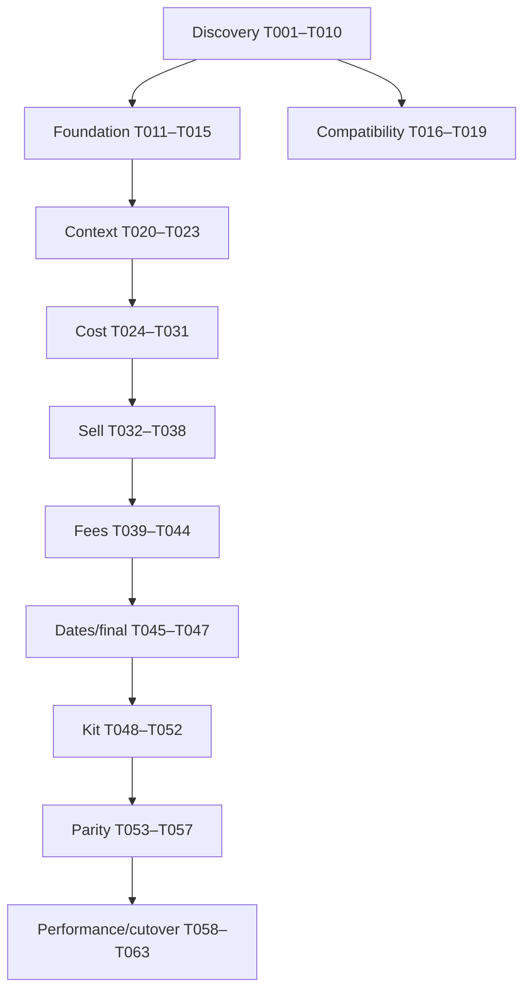

# Tasks: COBOL Pricing Modernization

## Conventions

- `[CLAUDE]`: Claude Code owns the work product.
- `[CODEX]`: Codex owns the implementation.
- `[SHARED]`: named owner executes; other agent reviews.
- `[P]`: may run in parallel with other tasks whose dependencies are satisfied.
- `[ ]` not started, `[~]` claimed/in progress, `[x]` complete, `[!]` blocked.
- Every task must satisfy `AGENTS.md` handoff requirements.

## Dependency Overview

## Phase 1 — Discovery and Evidence

- [ ] T001 [CLAUDE] Create `docs/cobol-analysis/program-inventory.md` for every supplied CBL/CPY file, including purpose, interface, calls, copies, SQL includes, major paragraphs, errors, and missing dependencies.
  - Depends on: none
  - Acceptance: all supplied files and visible links/includes accounted for; regular and kit call graph included; confidence labels used.

- [ ] T002 [P] [CLAUDE] Create `docs/cobol-analysis/call-graph.md` with CICS links, request/response structures, routing conditions, and unresolved targets.
  - Depends on: none
  - Acceptance: caller/callee, COMMAREA, CICS response handling, and product-type routing documented.

- [x] T003 [P] [CLAUDE] Create `docs/mappings/omgpr-data-dictionary.csv` and `.md` with every field, PIC, storage, sign, scale, occurrence, classification, default, 88 values, proposed C# type, length, and offset/confidence.
  - Owner: Claude
  - Reviewed by: Codex for T013 implementability; COMP sizing and live-layout open items remain compatibility blockers.
  - Depends on: none
  - Acceptance: reconciles or explicitly explains the 1,789-byte layout; no unmarked guesses.

- [ ] T004 [P] [CLAUDE] Create `docs/mappings/omgexpl-data-dictionary.csv` and `docs/cobol-analysis/kit-processing.md`.
  - Depends on: none
  - Acceptance: component capacity, quantity, UOM, level, sub-pack, rollup, errors, and expiration documented.

- [ ] T005 [P] [CLAUDE] Create `docs/cobol-analysis/sql-query-inventory.csv` and `db2-table-inventory.md` for all visible SQL blocks and includes.
  - Depends on: none
  - Acceptance: host variables, date filters, ordering, SQLCODE paths, cursor lifecycle, and business purpose captured.

- [ ] T006 [P] [CLAUDE] Create `docs/cobol-analysis/error-catalog.md` mapping validation, SQL, CICS, kit, and component error paths to OMGPR fields.
  - Depends on: T001
  - Acceptance: error numbers/codes/messages and stop/continue behavior documented.

- [ ] T007 [CLAUDE] Create `docs/rules/cost-selection-rules.md` as an ordered decision table starting from A6U01 cost control paragraphs and all transitive paragraphs.
  - Depends on: T001, T005
  - Acceptance: individual, account/customer, group, parent, special, healthcare, and acquisition fallback paths covered where evidenced.

- [ ] T008 [P] [CLAUDE] Create `docs/rules/sell-selection-rules.md` with hierarchy, formulas, price lock, and list-price fallback.
  - Depends on: T001, T005
  - Acceptance: account, customer, contract, group, parent, corporate, product, category, vendor, and default paths covered.

- [ ] T009 [P] [CLAUDE] Create `docs/rules/fees-and-adjustments.md` covering rebates, freight, JIT, PANDAC, SurgiTrak, low-UOM, break-bulk, label/application, delivery, surcharge, distribution, and markup.
  - Depends on: T001, T005
  - Acceptance: eligibility, priority, exemptions, calculation, dates, outputs, and errors per rule.

- [ ] T010 [P] [CLAUDE] Create `docs/rules/date-selection.md`, `rounding.md`, and `docs/characterization/scenario-catalog.md`.
  - Depends on: T001, T005
  - Acceptance: boundary behavior, null dates, closest expiration, rounding stages, and minimum scenario matrix documented.

### Gate G1 — Discovery Review

- [x] G1 [SHARED] Codex reviews T001–T010 for implementability; Claude resolves evidence gaps or marks blockers. No pricing-rule implementation starts before approval.
  - Owner: Codex
  - Reviewer: Codex
  - Review: `docs/reviews/g1-implementability-review.md`
  - Evidence: Codex re-reviewed T001–T010 directly from `origin/agent/claude-discovery` at `ff0c9f0e31e0dd85055c2ef8a62033fa2ffb21e6`; each prior gap is classified in the review as resolved, partially resolved with a downstream blocker, or explicitly blocked due to unavailable source.
  - Approved: Codex reviewed T001–T010 through Claude commit `ff0c9f0`; unresolved evidence is explicitly scoped as downstream blockers.

## Phase 2 — .NET Foundation

- [x] T011 [P] [CODEX] Create the .NET 8 solution and projects from `plan.md` with central package management, nullable references, analyzers, and baseline tests.
  - Owner: Codex
  - Depends on: none
  - Acceptance: clean restore/build/test; dependency direction documented and enforced.

- [x] T012 [P] [CODEX] Configure Pricing.Api with OpenAPI, ProblemDetails, health checks, structured logging, OpenTelemetry, correlation, and cancellation.
  - Owner: Codex
  - Depends on: T011
  - Acceptance: API starts; health/OpenAPI available; smoke tests pass.

- [x] T013 [P] [CODEX] Implement domain value objects: Money, Percentage, identifiers, UOM, Quantity, and PricingDateRange.
  - Owner: Codex
  - Depends on: T011, T003 reviewed
  - Acceptance: immutable; decimal-only; validation, equality, serialization, and boundary tests.

- [x] T014 [P] [CODEX] Implement PricingRequest, PricingContext, PricingResult, ProductInformation, CustomerInformation, ContractSelection, SellArrangementSelection, PriceComponent, and typed errors.
  - Owner: Codex
  - Depends on: T011, T013
  - Acceptance: models separate input/context/output and retain provenance.

- [x] T015 [CODEX] Add CI workflow for formatting, restore, build, tests, analyzers, dependency audit, and test artifacts.
  - Owner: Codex
  - Depends on: T011
  - Acceptance: workflow syntax validated; local equivalents documented.

## Phase 3 — OMGPR Compatibility

- [ ] T016 [CLAUDE] Produce `docs/mappings/omgpr-test-vectors.json` with confirmed positive, negative, zero, scale, spaces, low values, and error-field cases.
  - Depends on: T003, G1
  - Acceptance: every vector cites copybook definition; unknown encoding/byte order parameterized.

- [x] T017 [CODEX] Implement configurable alphanumeric, COMP, and COMP-3 primitives in Pricing.Compatibility.
  - Owner: Codex
  - Depends on: T011, T003, T016
  - Acceptance: valid/invalid, signs, scales, byte order, overflow, and cancellation-independent deterministic tests.
  - Evidence: configurable CP037/Windows-1252 alphanumeric, big/little-endian signed COMP, and signed/unsigned COMP-3 codecs; T016 representative vectors and invalid-format/overflow tests pass.

- [x] T018 [CODEX] Implement 1,789-byte OMGPR decoder and map legacy input to PricingRequest.
  - Owner: Codex
  - Depends on: T014, T017
  - Acceptance: length validation; centralized offsets; vectors pass; no legacy binary concerns leak into domain.
  - Assumption: Claude decision record `d264fde` directs use of the 1,773-byte mainframe-COMP layout within the confirmed 1,789-byte buffer and preservation of bytes 1774–1789 as opaque data.
  - Evidence: configurable mainframe-EBCDIC and Micro Focus ASCII-native decoding, centralized input offsets, exact-length validation, domain mapping, opaque-tail preservation, and 67 focused unit tests pass.

- [x] T019 [CODEX] Implement PricingResult-to-OMGPR encoder and round-trip tests.
  - Owner: Codex
  - Depends on: T018
  - Acceptance: exact output length; preserved required input fields; legacy error fields mapped; test vectors pass.
  - Evidence: conservative overlay encoder writes confirmed cost/sell/expiration/error fields, preserves all original unmapped bytes and the opaque 16-byte tail, and passes 72 focused unit tests plus the full solution suite.

### Gate G2 — Compatibility Review

- [x] G2 [SHARED] Claude reviews codecs against copybooks and vectors; Codex resolves findings. Encoding and byte order must be confirmed or remain deployment blockers.
  - Owner: Codex
  - Reviewer: Claude
  - Handoff: `docs/reviews/g2-compatibility-handoff.md`
  - Review: Claude commit `472e5c1` — NOT APPROVED with six findings.
  - Re-review: Claude commit `f71c7e0` — original six findings verified fixed; one residual severity-field finding.
  - Resolution: Codex addressed all seven findings on 2026-07-21.
  - Approval: Claude commit `f845649`; independently verified 85/85 tests pass.
  - Deployment blockers: live OMGPR encoding and byte order remain unconfirmed pending a compiled listing or COMMAREA capture.

## Phase 4 — Product and Customer Context

- [x] T020 [CODEX] Implement ProductClassificationService based on A6O010U behavior.
  - Owner: Codex
  - Depends on: T014, G1
  - Acceptance: missing vendor/product, regular, kit type O, not found, database failure, and cancellation tests.
  - Evidence: A6O010U `1000-VALIDATE-INPUT`/`0200-READ-PRODUCT-DATA` and A6O016U `2200-READ-PRODUCT-DATA`/`9015-SELECT-VNG02`; 89 focused unit tests and 95 solution tests pass.

- [x] T021 [CODEX] Implement ProductInformationService contract and repository for category, inventory class, base/alternate UOM, conversion, and dates.
  - Owner: Codex
  - Depends on: T014, T005
  - Acceptance: inferred A6O013U behavior isolated and feature-blocked until confirmed.
  - Evidence: A6O013U is now supplied and confirms `1000-VALIDATE-INPUT`/`2000-READ-PRODUCT-DATA`; A6O016U confirms VNG02/VNG06/ING01/VNG05 sequencing and error semantics. 99 focused unit tests and 105 solution tests pass.

- [x] T022 [CODEX] Implement CustomerPricingContextService contracts and orchestration based on CUP100 analysis.
  - Owner: Codex
  - Depends on: T014, T005, G1
  - Acceptance: account/customer, memberships, parents, priorities, exclusions, fees, low-UOM, freight, and components represented.
  - Evidence: CUP100 A200/A300, A425, A800-A850, 1000, 2000, and 3000 context flows are represented behind one business-oriented repository; 105 unit tests and 111 solution tests pass.

- [x] T023 [P] [CODEX] Implement DB2 access infrastructure, connection health, transient-error mapping, query tracing, and integration-test fixtures.
  - Owner: Codex
  - Depends on: T011, T005
  - Acceptance: business-oriented repository boundaries; parameterized SQL; no production credentials; SQL and cancellation tests.
  - Evidence: provider-neutral DB2 connections, Dapper query execution, readiness probe, SQLSTATE/error-code transient mapping, safe OpenTelemetry activities, and sanitized recording fixtures; 8 integration tests and 115 solution tests pass.

## Phase 5 — Cost Engine

- [x] T024 [CODEX] Implement ordered ICostRule framework, evaluator, trace, skip reasons, provenance, and duplicate-priority validation.
  - Owner: Codex
  - Depends on: T014, T007, T022
  - Acceptance: deterministic ordering; first applicable rule semantics; full trace tests.
  - Evidence: immutable applied/skipped/failed decisions, ascending-priority evaluator, explicit skip/not-evaluated trace with provenance, fail-fast configuration validation, and cancellation; 112 unit tests and 122 solution tests pass.

- [x] T025 [P] [CODEX] Implement individual and account/customer cost-contract rules.
  - Owner: Codex
  - Depends on: T024, T023
  - Acceptance: applies/non-applies/excluded/expired/zero/competitor/fallback tests per rule.
  - Evidence: A6U01 0235/0270/0272 individual-customer selection with account/ship-to exclusion outcome, inclusive date defense, cursor-order-preserving strict-lowest duplicate selection, valid first-zero behavior, typed failures, and provenance; 123 unit tests and 133 solution tests pass.

- [x] T026 [P] [CODEX] Implement primary, other, and parent buying-group cost rules.
  - Owner: Codex
  - Depends on: T024, T023
  - Acceptance: membership and priority hierarchy parity tests.
  - Evidence: A6U01 0240/0275/0280 scope ordering, override-before-priority cascade, and 0315/7315/7320/7321 child-then-full-ancestor traversal are represented without flattening; selected contracts retain group, priority, hierarchy, override, and provenance metadata; 132 unit tests and 142 solution tests pass.

- [x] T027 [P] [CODEX] Implement special-contract cost behavior.
  - Owner: Codex
  - Depends on: T024, T007
  - Acceptance: special path, early exit, rounding, and expiration verified.
  - Evidence: OMGPR byte 152 special flag decoding, bypass-B repository contract, priority-50 restricted individual selection, fatal #601 miss, raw cost/suggested-sell output, adjustment and final-rounding bypass, expiration-source retention, and evaluator early exit; 143 unit tests and 153 solution tests pass.

- [x] T028 [P] [CODEX] Implement healthcare override cost rule using HCOVD structures.
  - Owner: Codex
  - Depends on: T024, T023
  - Acceptance: account/CID/group/product/date/type/percent/fixed cases.
  - Evidence: A6U01 9940/9945/9950 account-before-CID eligibility across four inclusive windows, product-over-group flag precedence, 9970 highest-acquisition/earliest-active VNG03 selection, normalized dealer cost, typed COST+ percentage and stated-price terms, provenance, failures, and cancellation; 155 unit tests and 165 solution tests pass.

- [x] T029 [CODEX] Implement acquisition/dealer-cost fallback as last cost rule.
  - Owner: Codex
  - Depends on: T025–T028
  - Acceptance: only runs after all higher rules fail; exemption resets match COBOL.
  - Evidence: A6U01 7105 direct VNG03 selection, 7575 latest-effective/highest-level fallback, and 7190 terminal dealer-cost/UOM copy with JIT/freight exemption resets; 162 unit tests and 172 solution tests pass.

- [x] T030 [CODEX] Implement rebate calculators and contract-entry-method exceptions.
  - Owner: Codex
  - Depends on: T024, T009
  - Acceptance: normal, methods 06/08, zero, negative, max, protected acquisition, and expiration tests.
  - Evidence: A6U01 0030 method-06/08 bypass and 7070 R-REBATE-000–006 base, sequential option overwrite, negative policy, protected acquisition, total, and max-cap behavior; 177 unit tests and 187 solution tests pass.

- [x] T031 [CODEX] Implement vendor cost adjustments and cost-side adjustment composition.
  - Owner: Codex
  - Depends on: T024, T009, T030
  - Acceptance: ordered composition, failure propagation, provenance, and parity fixtures.
  - Evidence: A6U01 0030, 0225/0230, 7215, and 7200 ordered first-match lookup contract, price-lock/healthcare bypass, base-cost percentage calculation, typed failure propagation, rebate-preserving cost composition, provenance, and representative formula fixtures; 189 unit tests and 199 solution tests pass. Live COBOL parity remains Gate G3 scope.

### Gate G3 — Cost Parity

- [!] G3 [SHARED] Run approved cost scenarios and require exact critical-field parity before sell implementation is declared complete.
  - Owner: Codex
  - Reviewer: Claude
  - Decision: NOT APPROVED on 2026-07-21; see `docs/reviews/g3-cost-parity-review.md`.
  - Blockers: no authoritative sanitized COBOL cost fixtures, no executable COBOL/C# cost comparisons, no COBOL adapter/capture, and runtime rounding-tie behavior remains unconfirmed. Current parity and characterization projects contain smoke tests only.

## Phase 6 — Sell Engine

- [x] T032 [CODEX] Implement ordered ISellArrangementRule framework and calculation-strategy contracts.
  - Owner: Codex
  - Depends on: T014, T008, T029
  - Acceptance: deterministic priority, trace, provenance, and no-arrangement behavior.
  - Evidence: A6U01 7180 dispatch into 0180/7075/0185 first-match cascades; deterministic evaluator, complete applied/skipped/not-evaluated/failure trace, explicit no-arrangement result for the later list-price fallback, and 7090 calculation-strategy contracts; 196 unit tests and 206 solution tests pass.

- [ ] T033 [P] [CODEX] Implement account and customer-number sell rules.
  - Depends on: T032

- [ ] T034 [P] [CODEX] Implement individual-contract and buying-group/parent sell rules.
  - Depends on: T032

- [ ] T035 [P] [CODEX] Implement corporate, product, category, vendor, and default sell rules.
  - Depends on: T032

- [ ] T036 [CODEX] Implement fixed, stated, cost-plus, cost-discount, gross-margin, suggested-sell, and list-price calculators.
  - Depends on: T032, T010
  - Acceptance: formula, scale, zero, negative guard where applicable, and rounding tests.

- [ ] T037 [CODEX] Implement price-lock behavior and tests.
  - Depends on: T033–T036

- [ ] T038 [CODEX] Implement sell adjustments and compose base sell, adjustments, and provenance.
  - Depends on: T037, T009

## Phase 7 — Fees and Surcharges

- [ ] T039 [P] [CODEX] Implement freight engine with account-first priority and single-source winner semantics.
  - Depends on: T009, T023, T031

- [ ] T040 [P] [CODEX] Implement JIT engine for A/C/P/R behaviors and exemptions.
  - Depends on: T009, T031, T038

- [ ] T041 [P] [CODEX] Implement low-UOM and break-bulk engines including eligibility, vendor/contract exclusions, group hierarchy, alt UOM, and zero percentage.
  - Depends on: T009, T023

- [ ] T042 [P] [CODEX] Implement PANDAC and SurgiTrak behavior including implied sell arrangement where evidenced.
  - Depends on: T009, T038

- [ ] T043 [P] [CODEX] Implement label, application, extra-delivery, and distribution fees.
  - Depends on: T009, T023

- [ ] T044 [CODEX] Implement category surcharge and sanctioned/non-sanctioned/individual/non-contract/customer markup composition.
  - Depends on: T009, T038

## Phase 8 — Dates, Rounding, and Final Result

- [ ] T045 [CODEX] Implement ExpirationDateCollector with source provenance and closest-valid-date logic.
  - Depends on: T010
  - Acceptance: null, duplicate, expired, same-day, leap-day, competing, and component tests.

- [ ] T046 [CODEX] Implement COBOL-compatible rounding policy and account configuration.
  - Depends on: T010, T013
  - Acceptance: proves stage-sensitive cases and all supported modes.

- [ ] T047 [CODEX] Implement PricingOrchestrator and PricingResultFactory across context, cost, rebate, sell, fees, rounding, expiration, warnings, and errors.
  - Depends on: T031, T038–T046
  - Acceptance: full regular-item scenario tests and explainable output.

## Phase 9 — Kit Pricing

- [ ] T048 [CLAUDE] Finalize confirmed kit decision table after missing A6O012U/A6O013U sources or interface evidence is obtained.
  - Depends on: T004
  - Acceptance: every inferred behavior resolved or explicitly blocked.

- [ ] T049 [CODEX] Implement IKitExplosionRepository, initially wrapping the legacy dependency when reimplementation evidence is incomplete.
  - Depends on: T048, T023

- [ ] T050 [CODEX] Implement component pricing loop through regular PricingOrchestrator with recursion/cycle/depth protection.
  - Depends on: T047, T049

- [ ] T051 [CODEX] Implement kit rollup for quantities, costs, rebates, adjustments, freight, JIT, vendor adjustments, overhead, third-party fees, and sell.
  - Depends on: T050, T004

- [ ] T052 [CODEX] Implement kit alternative-UOM conversion, earliest expiration, and component error propagation.
  - Depends on: T045, T046, T051

### Gate G4 — Kit Parity

- [ ] G4 [SHARED] Compare approved component and rollup cases; critical fields and decision paths must match.

## Phase 10 — API and Parity Operations

- [ ] T053 [CODEX] Implement `POST /api/v1/prices/calculate` from the OpenAPI contract with regular/kit routing and all request modes.
  - Depends on: T047, T052

- [ ] T054 [CODEX] Implement validation, ProblemDetails, modern/legacy error mapping, authentication/authorization hooks, rate/input limits, and audit correlation.
  - Depends on: T006, T012, T053

- [ ] T055 [CLAUDE] Produce sanitized COBOL characterization fixtures with expected decision paths and critical outputs.
  - Depends on: T006–T010

- [ ] T056 [CODEX] Build ParityRunner to invoke COBOL adapter and C# service for identical inputs and persist comparison results.
  - Depends on: T019, T047, T052, T055

- [ ] T057 [CODEX] Implement difference classification: exact, rounding, rule, missing/additional fee, date, contract, error, and missing-data differences.
  - Depends on: T056
  - Acceptance: rule/contract mismatch is critical even if totals match.

## Phase 11 — Performance, Shadow, and Cutover

- [ ] T058 [CLAUDE] Document COBOL performance baseline method and representative workload dimensions.
  - Depends on: T055

- [ ] T059 [CODEX] Implement performance/load tests and report DB calls, latency percentiles, throughput, memory, error rate, and kit-size effects.
  - Depends on: T053, T058

- [ ] T060 [CODEX] Optimize verified hotspots using indexes/query changes/batching/request caching without changing results.
  - Depends on: T057, T059
  - Acceptance: parity suite unchanged; cache keys include every pricing determinant and pricing date.

- [ ] T061 [CODEX] Implement shadow execution, sampling, metrics, safe difference logs, dashboards/alerts definitions, and COBOL-authoritative response selection.
  - Depends on: T057, T060

- [ ] T062 [CODEX] Implement scoped cutover flags by division/customer/product/request type/traffic percentage and immediate COBOL rollback.
  - Depends on: T061

- [ ] T063 [SHARED] Produce cutover runbook, support guide, approval checklist, rollback drill evidence, and final parity/performance report.
  - Depends on: T061, T062

## Final Definition of Done

- All constitutional delivery gates approved.
- All confirmed legacy behavior traced and tested.
- No unresolved blocker affects the pilot scope.
- Critical parity is exact for the approved suite and shadow window.
- Security, observability, performance, rollback, and support readiness approved.
- COBOL retirement is a separate, explicitly approved specification.
